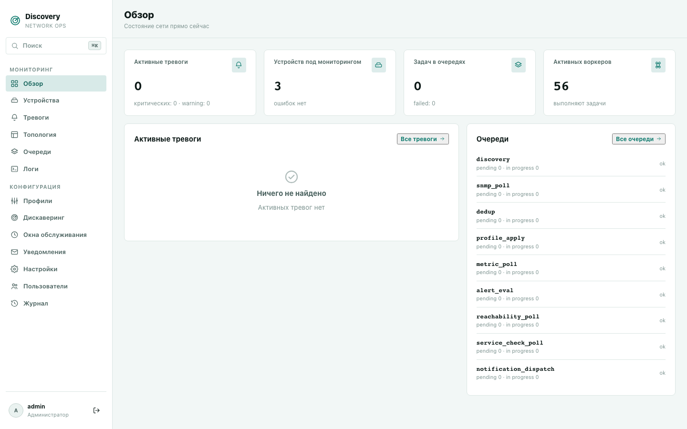
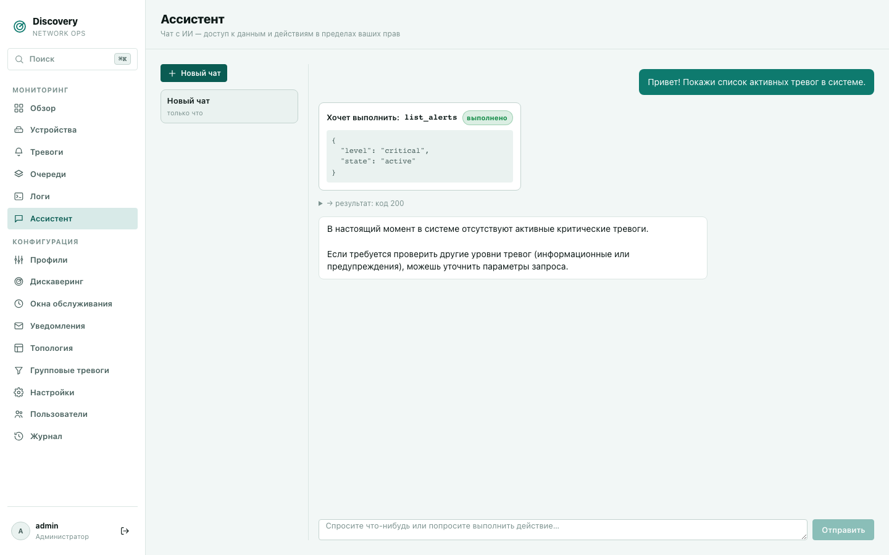
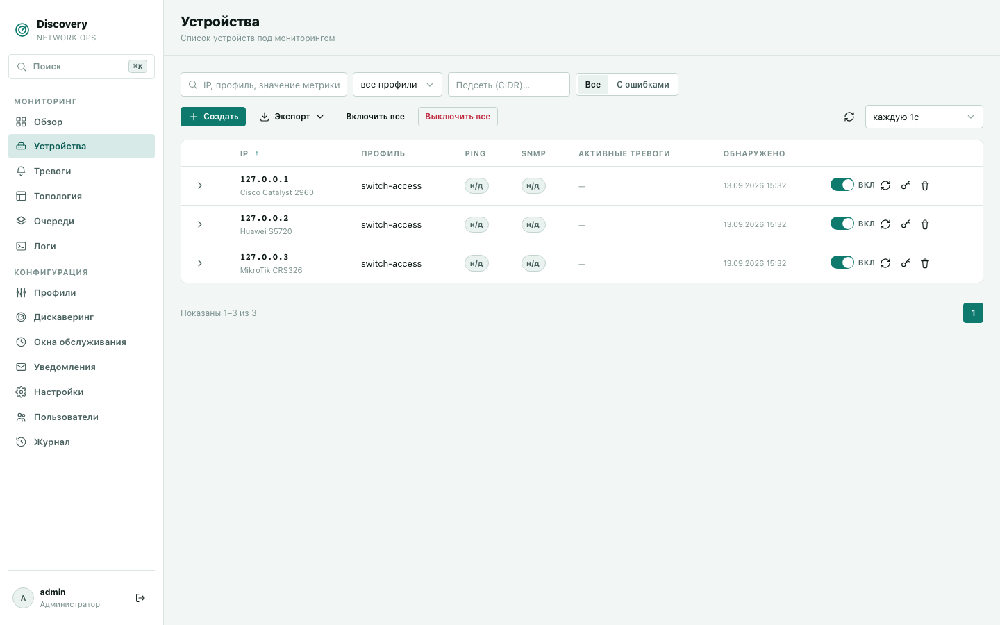
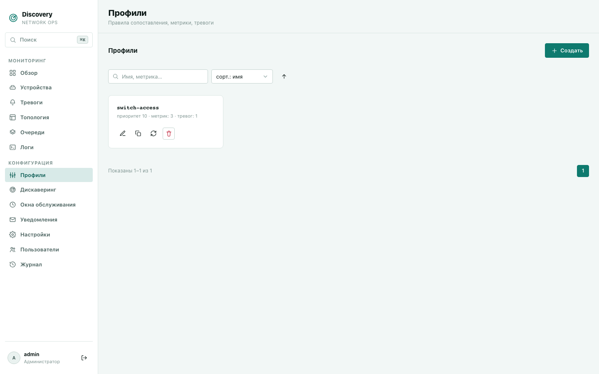

# Возможности

Это общий обзор — что умеет продукт. Для подробного описания каждого поля, кнопки и
действия в конкретном разделе дашборда см.
[Подробное руководство по разделам](features/) (отдельный файл на каждый пункт меню).

## Ассистент

Чат с ИИ (GigaChat, OpenRouter или собственный self-hosted сервер — на выбор
администратора) прямо в дашборде — можно спросить о текущем состоянии сети или
попросить что-то сделать обычным языком, не переключаясь между разделами вручную. У
ассистента нет собственных прав — он видит и может менять ровно то же самое, что и
пользователь, который с ним общается, в пределах его роли. По умолчанию любое изменяющее
действие (закрыть тревогу, поставить окно обслуживания и т.п.) требует явного
подтверждения. Для текущего разговора пользователь может включить режим без пошагового
подтверждения; права и отдельное подтверждение опасных/необратимых действий при этом
сохраняются.

Подробнее: [Ассистент](features/ai-assistant.md).

## Обнаружение устройств (Discovery)

Укажите подсеть и SNMP read-community — discovery сам просканирует диапазон, определит,
какие адреса отвечают, и создаст запись устройства для каждого найденного узла. Не нужно
вручную вносить каждый коммутатор или OLT в систему по отдельности.

Подробнее: [Устройства](features/devices.md), [Дискаверинг](features/discovery-configs.md).

## Профили и опрос метрик

Профиль — это правило «какие устройства это касается» (по IP-диапазону, модели, другому
признаку) плюс список метрик для опроса: любые SNMP OID, с любой периодичностью, под
любую модель оборудования — от базовых `sysDescr`/`sysUpTime` до вендор-специфичных
счётчиков конкретного производителя. Один профиль применяется сразу ко всем подходящим
устройствам.

Помимо обычного опроса, поддерживаются:
- **Производные метрики** — счётчики-в-секунду (rate/delta) из накопительных SNMP
  счётчиков, с корректной обработкой переполнения/сброса счётчика.
- **Сервис-чеки** — проверка доступности TCP/HTTP/SSH-сервисов на устройстве, не только
  SNMP.
- **SSH CLI-опрос** — снятие конфигурации устройства по SSH (например, для проверки
  соответствия эталонной конфигурации).
- **SNMP Trap и Syslog** — приём push-уведомлений от устройств напрямую, не только
  активный опрос.

Подробнее: [Профили](features/profiles.md).

## Тревоги

Пороговые срабатывания на любую метрику — «оповестить, если метрика вышла за границу».
Тревоги используют гистерезис (отдельные пороги на срабатывание и на снятие), чтобы не
дребезжать на границе значения, а flapping подавляет шторм activation/recovery при частых
переходах. Для активной тревоги оператор может отдельно отметить подтверждение или задать
срок snooze; это не закрывает тревогу и не заменяет окно обслуживания. Повторы уведомлений
и уровни escalation настраиваются явно и прекращаются после acknowledgement, recovery или
ручного закрытия.

Системные тревоги system.device_down, system.snmp_down и system.stale_metric
ведутся раздельно: недоступность устройства, недоступность SNMP и устаревшая метрика — это
разные состояния и не должны сливаться в один инцидент.

Подробнее: [Тревоги](features/alerts.md).

## Сервис-дискаверинг

Для неизвестного IP можно запустить разовую ограниченную проверку SNMP, SSH, HTTP, HTTPS и
TCP. Каждая проба имеет таймаут, действует общий лимит 64 проверок и 30 секунд. При успехе
система идемпотентно находит устройство по IP и назначает профиль с наивысшим приоритетом;
если не прошла ни одна проверка, устройство не создаётся.

Подробнее: [Устройства](features/devices.md#разовое-обнаружение-сервисов).

## Уведомления

Email, Telegram, webhook (с опциональной HMAC-подписью для webhook). Гибкая матрица «кого
извещать по какой тревоге»: порог серьёзности, выбор конкретных устройств, временное окно
(например, не будить дежурного ночью по некритичным тревогам).

Подробнее: [Уведомления](features/notifications.md).

## Окна обслуживания (Maintenance Windows)

Плановые работы не должны генерировать ложные тревоги и рассылки. Задайте окно
обслуживания (по времени, конкретным устройствам, диапазону IP или профилю) — тревоги за
это время подавляются, но не удаляются из истории.

Подробнее: [Окна обслуживания](features/maintenance-windows.md).

## Топология

Настраиваемый механизм определения связей между устройствами — не жёстко зашитый
протокол (LLDP/CDP), а правило, которое вы (или интегратор при внедрении) описываете на
основе уже опрашиваемых метрик: как устройство называет себя и кого оно считает соседом.
Пересчитывается сразу при обновлении нужной метрики, без опроса всей сети по расписанию.
Правило также может определять направление связи (кто чей аплинк).

Подробнее: [Топология](features/topology.md).

## Безопасные действия и backup конфигурации

Для включённого устройства доступны фиксированные действия test, poll now, rediscover
и backup. Они выполняются через отдельную очередь, проверяют RBAC и не принимают от
оператора произвольные команды изменения устройства. Backup v1 использует только
профильную read-only SSH-команду, хранит результат зашифрованно, скрывает секреты и
показывает ограниченный diff нормализованных версий.

## Групповые тревоги

При падении общего узла сети (аплинка) — одна причинная тревога вместо шторма одинаковых
оповещений с каждого зависимого устройства за ним. Discovery сверяет активные тревоги с
топологией и настраиваемыми правилами «причина → следствие», автоматически помечает
зависимые тревоги как подавленные и так же автоматически снимает пометку, когда причина
устранена.

Подробнее: [Групповые тревоги](features/group-alerts.md).

## Управление доступом

Локальная аутентификация, без внешних провайдеров (LDAP/Kerberos/OAuth не реализованы).
RBAC по 12 доменам данных (устройства, профили, тревоги, дискаверинг, метрики устройств,
логи, очереди, окна обслуживания, уведомления, топология, групповые тревоги, настройки), с
тремя уровнями
доступа на каждый домен — нет доступа / только чтение / чтение и запись. Права назначаются
не пользователю напрямую, а через роль — именованный набор уровней доступа по всем доменам
сразу, накладываемый на пользователя целиком.

Подробнее: [Пользователи](features/users.md).

## Веб-дашборд

Вся работа — через браузер: устройства, профили, дискаверинг, тревоги,
уведомления, окна обслуживания, журнал действий пользователей. Ничего не нужно
устанавливать себе на компьютер отдельно, кроме самого discovery на сервере.

Дополнительные разделы дашборда: [Обзор](features/overview.md), [Очереди](features/queues.md),
[Логи](features/logs.md), [Настройки](features/settings.md), [Журнал](features/journal.md).
