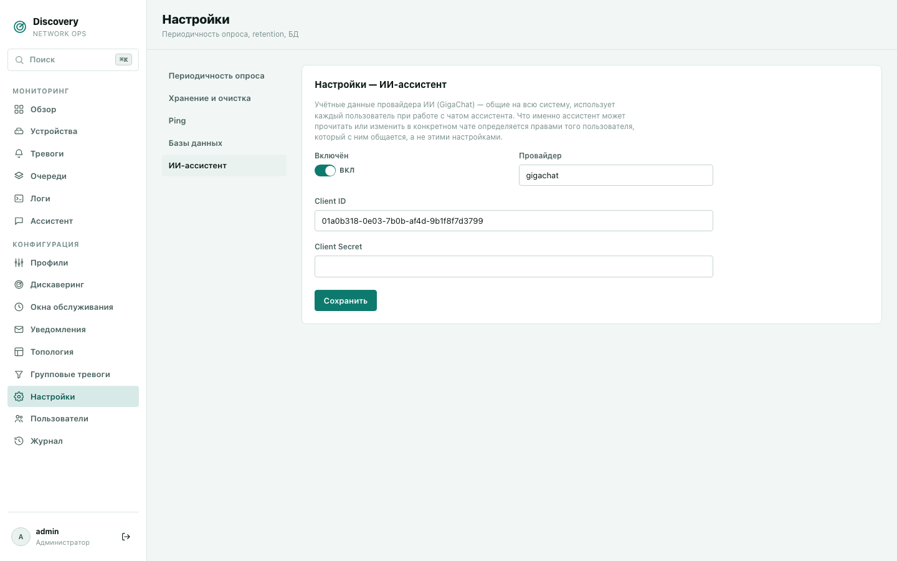

# Ассистент

Чат с ИИ прямо в дашборде — можно спросить про текущее состояние сети или попросить
что-то сделать, не переключаясь на страницы устройств/тревог/окон обслуживания вручную.

## Что важно понимать про права доступа

**У ассистента нет собственных, отдельных прав.** Он видит и может менять ровно то же
самое, что и вы сами — в пределах вашей роли. Если у вас нет доступа на запись в раздел
«Устройства», попросить ассистента что-то изменить в устройствах не даст обхода этого
ограничения — он получит точно такой же отказ в доступе, какой получили бы вы сами через
обычную форму.

**Каждое изменяющее действие требует вашего явного подтверждения.** Если вы просите
ассистента что-то *посмотреть* (список тревог, состояние устройства, список окон
обслуживания) — он делает это сразу и показывает результат. Если вы просите что-то
*изменить* (закрыть тревогу, поставить окно обслуживания, включить/выключить устройство,
поставить очередь на паузу) — он не делает это молча. Вместо этого в чате появляется
карточка с описанием того, что именно он собирается сделать, и двумя кнопками —
**Подтвердить** и **Отклонить**. Пока карточка не разрешена, отправить следующее
сообщение нельзя — сначала нужно решить, что делать с предложенным действием.

## Как начать разговор

Слева — список ваших чатов (видны только вам, чужие разговоры недоступны). Кнопка «Новый
чат» создаёт пустой разговор. Просто напишите вопрос или просьбу обычным языком — не
нужно знать никаких специальных команд или синтаксиса.

Примеры того, что можно спросить:
- «Покажи активные критические тревоги»
- «Какие устройства сейчас недоступны?»
- «Поставь окно обслуживания на завтра с 22:00 до 02:00 для профиля olt»
- «Закрой тревогу по устройству 10.0.0.5»
- «Что происходит с очередью опроса метрик?»

## Что видно в переписке

- Ваши сообщения и финальные ответы ассистента — обычные реплики.
- Если ассистент решил что-то посмотреть в системе (тревоги, устройства и т.п.) — это
  показывается отдельной свёрнутой строкой «→ результат: …», которую можно раскрыть, если
  интересны точные данные, на основе которых он отвечает.
- Если ассистент предлагает что-то изменить — это отдельная карточка с названием
  действия, его параметрами и (пока не разрешено) кнопками подтверждения.

## Настройка (только для администратора)

Чтобы ассистент вообще заработал, администратор должен один раз подключить провайдера
ИИ — вкладка **«ИИ-ассистент»** на странице «Настройки».

- **Включён** — общий выключатель. Пока он выключен (или не заполнены обязательные поля
  выбранного провайдера), обычные пользователи при попытке написать в чат увидят понятное
  сообщение «ИИ-ассистент не настроен» вместо ошибки.
- **Провайдер** — GigaChat (Сбер), OpenRouter или Self-hosted (свой сервер). Поля формы
  меняются в зависимости от выбора:
  - **GigaChat** — единый **Authorization key** из вашего проекта в GigaChat Studio (сам
    является `base64(Client ID:Client Secret)` и разбирается автоматически — Client ID/Secret
    по отдельности вводить не нужно) + **тариф (scope)**, который должен совпадать с реально
    подключённым в GigaChat Studio тарифом.
  - **OpenRouter** — API-ключ с [openrouter.ai](https://openrouter.ai) и название модели
    (например, `deepseek/deepseek-v4-flash-0731:free`) — любая модель, доступная вашему
    ключу и поддерживающая вызов инструментов (tool calling).
  - **Self-hosted** — для собственного сервера с моделью (vLLM, Ollama, LM Studio,
    text-generation-webui и любой другой, совместимый по формату с OpenAI Chat
    Completions API): **Base URL** — полный адрес эндпоинта чата на вашем сервере
    (например, `http://localhost:11434/v1/chat/completions` для локального Ollama,
    `http://vllm-host:8000/v1/chat/completions` для vLLM) — без значения по умолчанию,
    указывается всегда явно; **API-ключ** — необязательно, многие self-hosted серверы
    работают вообще без авторизации, оставьте пустым, если ваш сервер её не требует;
    **Model** — имя модели, под которым её знает сам сервер.
- **Authorization key** / **API-ключ** хранится зашифрованным (требует настроенный
  `DISCOVERY_SECRET_KEY` на сервере, см. [Справочник конфигурации](../configuration.md))
  и никогда не приходит обратно с сервера — поле всегда пустое при открытии страницы;
  оставьте его пустым, если не хотите менять уже сохранённый секрет. Для self-hosted без
  ключа это поле можно просто оставить пустым и при первой настройке.

**О работоспособности self-hosted-провайдера:** формат обмена данными с сервером —
тот же протокол (OpenAI-совместимый `tools`/`tool_calls`), что и у OpenRouter, и покрыт
протокольными тестами — но, в отличие от GigaChat и OpenRouter, не проверялся вживую
против реального работающего vLLM/Ollama/LM Studio сервера. Если у вас что-то не
работает именно с self-hosted-провайдером — см.
[Диагностика проблем](../troubleshooting.md#ассистент-отвечает-ошибкой-при-отправке-сообщения).

Эти настройки общие на всю систему — один провайдер сразу для всех пользователей. То,
что именно ассистент может сделать в конкретном разговоре, определяется не этими
настройками, а правами того, кто с ним общается (см. выше).

## Быстрое подтверждение для одного разговора

Над перепиской есть переключатель, который выключает пошаговое подтверждение для
**текущего разговора**: пока он включён, ассистент выполняет изменяющие действия сразу,
без карточки «Подтвердить/Отклонить». Модель доступа при этом не меняется — каждое
действие по-прежнему проверяет права того, кто ведёт разговор, в момент выполнения; в
журнале действий такие записи отдельно помечены как выполненные автоматически. Включайте
это только для разговоров, где вы уже доверяете сформулированной задаче — переключатель
действует только на текущий разговор и не сохраняется как общая настройка.
