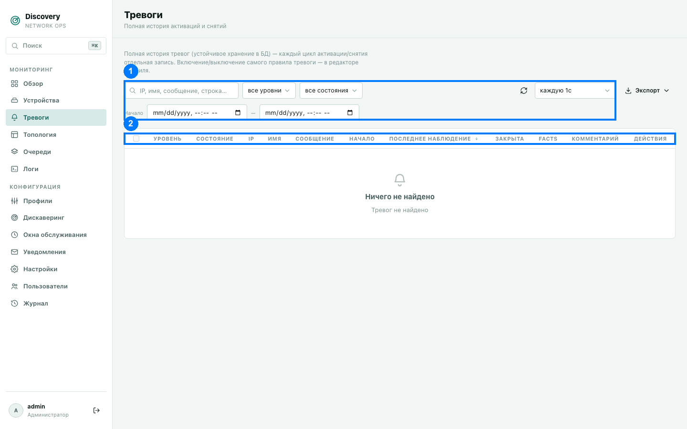

# Тревоги

Полная история срабатываний — и активных сейчас, и уже закрытых за всё время. В отличие
от карточки на странице «Обзор» (только 10 последних активных), здесь — весь список с
фильтрами, сортировкой и историей.

1. Панель фильтров · 2. Заголовки столбцов

На скриншоте выше активных тревог нет — показан пустой список. Ниже описано, как выглядит
и ведёт себя список с реальными тревогами, по коду.

## Что такое тревога и как она возникает

Тревога — это срабатывание правила, заданного в профиле устройства (см.
[Профили](profiles.md) → вкладка «Тревоги»). У правила есть условие активации (например,
«загрузка CPU выше 90%») и, отдельно, условие деактивации (например, «загрузка CPU ниже
70%»). Именно раздельные условия делают возможным **гистерезис** — тревога не начинает
дребезжать (activate → clear → activate...) на границе одного порога: она остаётся
активной всё время, пока метрика находится в «мёртвой зоне» между порогом срабатывания и
порогом снятия.

Если правило не задаёт отдельного условия деактивации — система по умолчанию считает
деактивацией просто отрицание условия активации.

**Уровни серьёзности:**
- `Critical` (красный) — серьёзная проблема: устройство недоступно, критичный порог
  нарушен.
- `Warning` (жёлтый) — предупреждение, не критично, но заслуживает внимания.
- `Info` (нейтральный) — информационное сообщение.

## Столбцы таблицы (2)

| Столбец | Что означает |
|---|---|
| Чекбокс | Для массового закрытия сразу нескольких тревог (см. ниже). Доступен только для активных тревог. |
| Уровень | Цветной бейдж — Critical/Warning/Info. |
| Устройство | IP устройства, вызвавшего тревогу — клик открывает карточку устройства в разделе «Устройства». |
| Тревога | Имя правила, идентичность строки (`row_key`) если тревога привязана к конкретному порту/строке метрики, и текст сообщения (из настроек правила в профиле). |
| Facts | Клик открывает полный снимок данных, которые были актуальны **в момент активации** этой конкретной тревоги (если правило настроено их сохранять) — автоматически форматируется как таблица, если это похоже на JSON/CSV/XML. |
| Обнаружена | Когда тревога впервые сработала. |
| Обновлена | Когда в последний раз подтверждалось, что условие всё ещё выполняется (для активной тревоги) — обновляется на каждом цикле проверки, даже если ничего не изменилось. |
| Статус | «Активна» / «Закрыта» (закрыта вручную — рядом имя закрывшего пользователя) / «Утеряна» (см. ниже). Дополнительные признаки: подтверждена, snooze до срока, flapping (уведомление подавлено), escalation level и group suppression. Для group suppression клик по бейджу открывает карточку причинной тревоги. |
| Комментарии | Число сообщений в обсуждении тревоги, если есть — клик открывает тред. |
| Действия | Закрыть (только для активных), Комментарии, Удалить. |

## Статус «Утеряна» — не то же самое, что «Закрыта»

Если тревога была привязана к конкретной строке метрики (например, к конкретному порту в
таблице интерфейсов) и эта строка полностью пропала из данных устройства (например, порт
исчез из таблицы после перезагрузки коммутатора) — тревога автоматически помечается как
«Утеряна», а не «Закрыта». Смысл разный: «Закрыта» означает, что условие деактивации
реально стало истинным (проблема решена); «Утеряна» означает, что система больше не может
проверить это условие вообще, потому что сама строка данных исчезла.

## Панель фильтров (1)

- **Поиск** — по IP устройства, имени тревоги, сообщению.
- **Уровень** — фильтр по Critical/Warning/Info.
- **Статус** — фильтр по активна/закрыта.
- **С — По** — период по дате обнаружения. По умолчанию оба поля пустые (показывается вся
  история без ограничения по времени) — это намеренно: список тревог не журнал за
  последние сутки, а полноценная база инцидентов, сужать которую по умолчанию не должно.
- **Период автообновления** — от отключено до раза в секунду (по умолчанию — без
  автообновления, список обновляется вручную или кнопкой ⟳).

## Действия

**Закрыть** — вручную закрывает активную тревогу; система запрашивает подтверждение,
поскольку это действие не проверяет реальное состояние устройства. Используется, когда вы
точно знаете, что проблема решена, но автоматическое условие деактивации почему-то не
сработало (например, устройство сняли с мониторинга раньше, чем оно успело бы само
подтвердить восстановление). При ручном закрытии в истории сохраняется, кто именно закрыл
тревогу. **Если условие на устройстве на самом деле всё ещё истинно** — тревога может
активироваться заново уже на следующей проверке; если это произошло в течение 10 минут
после ручного закрытия, новая запись помечается бейджем «повторная» со ссылкой на
предыдущую (закрытую) запись — чтобы история расследования не терялась.

**Подтвердить** — операторская отметка с именем и временем. Она не меняет состояние
тревоги и не останавливает её проверку. **Снять подтверждение** удаляет только эту
отметку.

**Snooze** — временно подавляет уведомления activation/recovery до указанного времени;
сама тревога остаётся активной. После истечения срока доставка снова разрешена. Snooze не
равен закрытию, окну обслуживания или групповой причинной suppression.

Если для правила задана политика повторов, активная неподтверждённая тревога получает
повторные уведомления после задержки и через заданный интервал. При достижении порога она
переходит на следующий уровень escalation с собственными получателями; повторы ограничены
максимумом и прекращаются после acknowledgement, recovery, snooze или ручного закрытия.

**Flapping** означает частые переходы между зонами активации и деактивации в заданном окне.
В этом состоянии сохраняются обычные lifecycle/history semantics, но activation/recovery
уведомления подавляются; в UI видны состояние и причина подавления.

Системные тревоги создаются независимо: system.device_down отражает недоступность
устройства, system.snmp_down — отдельную проблему SNMP, а system.stale_metric —
метрику, которая не обновлялась дольше ожидаемого срока. Отключённые и календарные метрики
не порождают stale-тревогу.

**Массовое закрытие** — выберите чекбоксами несколько активных тревог (или «выбрать все
активные») и закройте их одним действием кнопкой «Закрыть все выбранные активные тревоги».

**Комментарии** — у каждой тревоги есть тред обсуждения: текстовые сообщения плюс
вложения (файлы, изображения, видео) — удобно, например, приложить скриншот с монтажом
или ссылку на тикет во внутренней системе учёта заявок.

**Удалить** — полностью удаляет запись о тревоге из истории. Не путать с закрытием —
удаление стирает саму запись, закрытие лишь переводит её в статус «Закрыта», сохраняя в
истории.

**Экспорт** — выгружает всю отфильтрованную выборку (не только текущую страницу) в файл со
всеми полями таблицы плюс технические поля (кем закрыта, причина авто-снятия).
