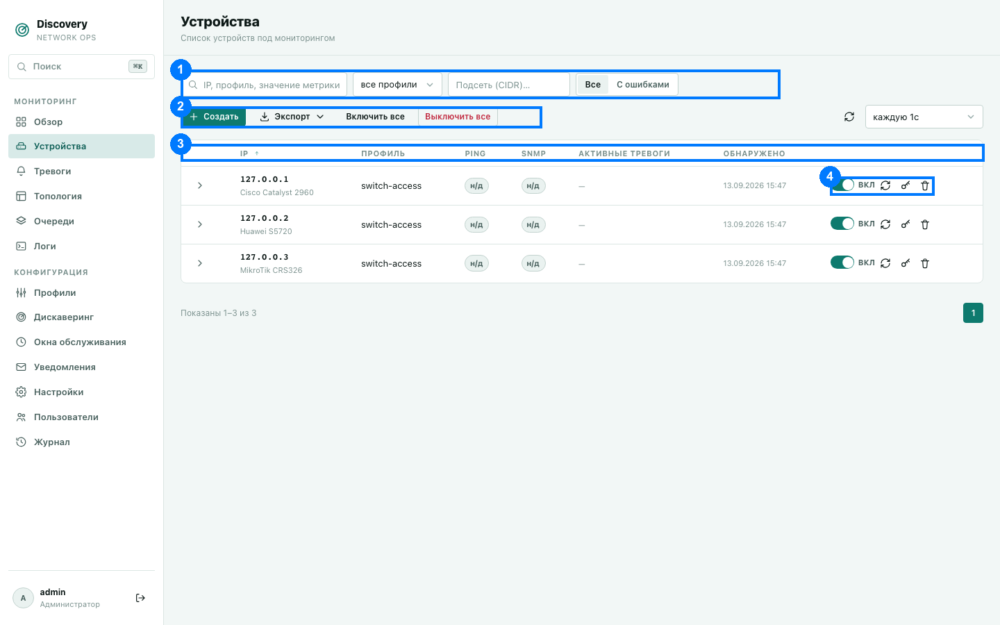
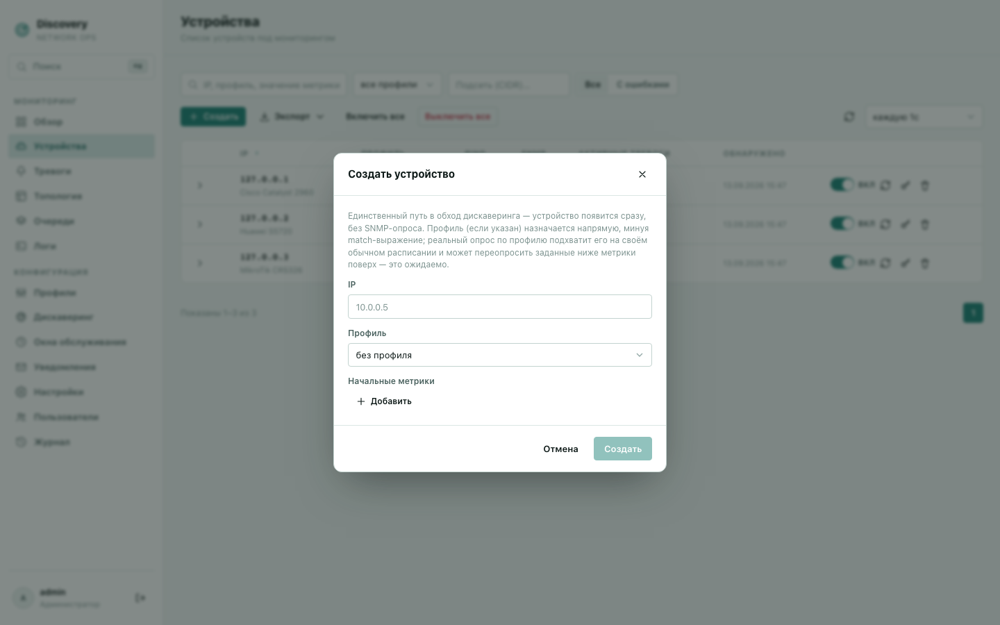
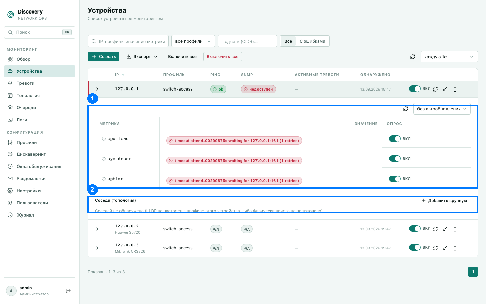

# Устройства

Полный список сетевого оборудования под мониторингом — коммутаторы, OLT, роутеры и всё
остальное, что появилось через дискaверинг или было добавлено вручную.

1. Панель фильтров и поиска · 2. Кнопки массовых действий · 3. Заголовки столбцов ·
4. Действия в строке устройства (переключатель, синхронизация, SSH-креды, удаление)

## Панель фильтров и поиска (1)

- **Поиск** (первое поле) — ищет одновременно по IP устройства, имени назначенного
  профиля и по значениям уже опрошенных метрик. Поиск срабатывает через паузу в 300 мс
  после последней набранной буквы — специально, чтобы не дёргать сервер на каждое
  нажатие клавиши.
- **Фильтр по профилю** (выпадающий список) — показать только устройства с конкретным
  назначенным профилем. Список профилей в выпадающем меню не зависит от того, у скольких
  устройств этот профиль реально назначен сейчас — профиль без единого устройства всё
  равно останется выбираемым.
- **Подсеть (CIDR)** — например `10.0.0.0/24`, показать только устройства с IP внутри
  этой подсети.
- **Переключатель «Все / С ошибками»** — «С ошибками» показывает только устройства, у
  которых ping или SNMP-опрос сейчас не проходит.

## Кнопки над таблицей (2)

- **Создать** — открывает форму ручного создания устройства (см. ниже).
- **Экспорт** — выгружает текущую отфильтрованную выборку целиком (не только видимую
  страницу) в файл. Выгружаются: IP, профиль, включено ли, статус ping, статус SNMP,
  число активных тревог, находится ли под окном обслуживания, дата обнаружения, все
  метрики в виде JSON.
- **Включить все / Выключить все** — массово включает или выключает мониторинг для всех
  устройств в текущей отфильтрованной выборке (не обязательно для всех устройств в
  системе — если применён фильтр, действие затронет только то, что показано). Запрашивает
  подтверждение перед выполнением.
- **Кнопка обновления (иконка ⟳)** — обновить список немедленно, не дожидаясь таймера
  автообновления.
- **Период автообновления** — от «без автообновления» до раза в 30 секунд. Автообновление
  списка автоматически приостанавливается, пока у вас развёрнута строка какого-либо
  устройства (см. ниже) — чтобы список не «прыгал» под курсором, пока вы смотрите детали.

## Столбцы таблицы (3)

| Столбец | Что означает |
|---|---|
| **IP** | Адрес устройства. Под ним — модель/вендор, если эта информация была получена (метрика с именем `vendor`). Пометка «выключено» — мониторинг устройства приостановлен. Бейдж «под ТО» — устройство сейчас попадает под активное [окно обслуживания](maintenance-windows.md). |
| **Профиль** | Имя назначенного профиля мониторинга — клик по имени открывает этот профиль на редактирование. Если профиль не назначен — «без профиля». |
| **Ping** | `ok` (зелёный) — устройство отвечает на ping; «недоступен» (красный) — не отвечает; «н/д» — проверка ещё не проводилась; «не опрашивается» — мониторинг устройства выключен целиком. |
| **SNMP** | То же самое, но для SNMP-опроса. |
| **Активные тревоги** | Число тревог, активных именно на этом устройстве прямо сейчас. Клик по числу открывает раздел «Тревоги», отфильтрованный на это устройство. Прочерк — активных тревог нет. |
| **Обнаружено** | Дата и время, когда устройство впервые появилось в системе. |

**Важно про «н/д» у только что созданного вручную устройства.** Если вы создали
устройство через кнопку «Создать» (см. ниже), статусы Ping и SNMP не заполняются
мгновенно — проверка встаёт в очередь и подхватывается фоновым циклом позже (обычно
несколько секунд, зависит от текущей загрузки системы). Это ожидаемое поведение, не
сбой. Устройства, найденные автоматически через
[«Дискaверинг»](discovery-configs.md), проходят полную проверку сразу же, как часть
самого процесса обнаружения.

## Действия в конце строки (4)

- **Переключатель вкл/выкл** — включить или выключить мониторинг именно этого устройства.
  Выключенное устройство не опрашивается вообще, но остаётся в списке и в базе.
- **Синхронизировать (иконка ⟳)** — принудительно применить настройки текущего профиля
  заново. Если у устройства есть ручные переопределения отдельных метрик (см. ниже), они
  будут сброшены — система заранее спросит подтверждение в этом случае.
- **SSH-креды (иконка ключа)** — задать логин/пароль или приватный ключ для SSH-доступа к
  устройству. Нужно только если в профиле используются метрики с источником «ssh
  (команда)» — обычный SNMP-опрос эти данные не использует и без них работает. Пароль/
  приватный ключ никогда не показываются повторно после сохранения — поля формы всегда
  открываются пустыми, вводить нужно только если хотите их поменять. При первом успешном
  подключении система запоминает ключ устройства («Host key» в той же форме) и сверяет
  его на каждом следующем подключении — защита от подмены устройства на сетевом пути.
  Смена SSH-кредов сбрасывает эту память, следующее подключение запомнит ключ заново.
- **Удалить (иконка корзины)** — полностью удаляет устройство вместе со всей его историей
  метрик и тревог (каскадно). Запрашивает подтверждение.

## Форма ручного создания устройства

Открывается кнопкой «Создать». Это единственный способ добавить устройство в обход
дискaверинга — оно появится в списке сразу, без ожидания SNMP-опроса.

- **IP** — обязательное поле.
- **Профиль** — необязательно. Если указан, назначается напрямую (без проверки
  match-выражения профиля) — но обычный опрос по расписанию профиля может впоследствии
  переопределить или пересчитать значения, это ожидаемо.
- **Начальные метрики** — необязательные пары «имя → значение», записываются один раз
  сразу при создании, без реального SNMP-опроса (полезно, например, чтобы сразу
  проставить метку региона `area_name`). Последующий реальный опрос по профилю может
  переопределить эти значения при следующем цикле.

**Лимит в пробном периоде:** пока действует бесплатный автоматический пробный период (см.
[Лицензирование и пробный период](../licensing.md)), можно добавить не более 50 устройств
— как через эту форму, так и через дискaверинг (лимит общий, а не отдельный для каждого
способа). При достижении лимита создание нового устройства отклоняется с понятным
сообщением об ошибке.

## Развёрнутая строка устройства

Клик по стрелке слева от IP раскрывает дополнительную панель с таблицей метрик.

### Таблица метрик

Список всех метрик, которые опрашиваются на этом устройстве согласно назначенному
профилю:

- **Метрика** — имя метрики; клик по имени открывает график/таблицу истории значений за
  выбранный период.
- **Значение** — текущее значение. Если метрика выключена — «не опрашивается
  (выключено)». Если последний опрос завершился ошибкой — красный бейдж с текстом
  ошибки. Если метрика табличная (например, список портов) — показывается количество
  строк, разворачиваемое кликом в полную таблицу.
- **Опрос** — переключатель вкл/выкл именно для этой метрики на этом конкретном
  устройстве, независимо от общих настроек профиля («override»). Если override уже
  установлен — рядом появляется кнопка сброса, возвращающая метрику на настройки профиля
  по умолчанию.

У этой таблицы своя отдельная кнопка обновления и период автообновления (по умолчанию —
без автообновления), не связанные с таймером обновления всего списка устройств.

## История значений метрики

Клик по имени метрики в развёрнутой таблице открывает отдельное окно с историей значений
за выбранный период — графиком (для числовых/логических метрик) или таблицей (для
текстовых). Записи с ошибкой опроса также отображаются на графике (на нулевой отметке,
пунктиром), чтобы было видно, что попытка опроса вообще была, просто неудачная.
