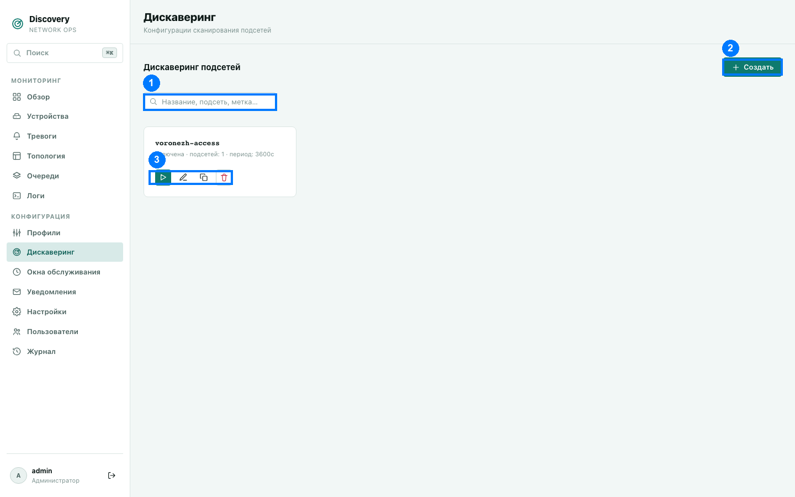
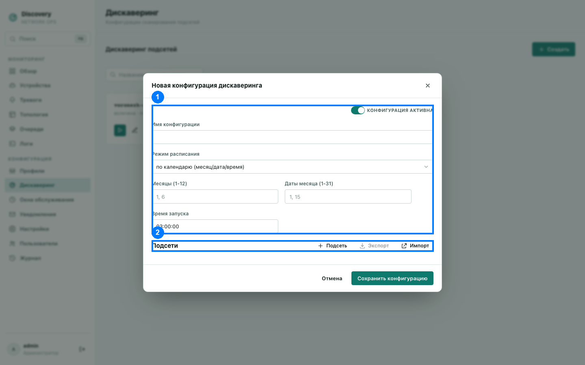

# Дискаверинг

Раздел «Дискаверинг» — настройка автоматического обнаружения устройств: какие подсети
сканировать, с какими SNMP-доступами и по какому расписанию.

1. Поиск · 2. Кнопка «Создать» · 3. Действия карточки (запустить, изменить, клонировать,
удалить)

## Список конфигураций

Каждая карточка — одна конфигурация: имя, включена/выключена, число подсетей в ней,
краткое описание расписания.

Действия карточки (3):
- **Запустить** (▶) — запустить сканирование прямо сейчас, не дожидаясь расписания.
  Работает даже для выключенной конфигурации — выключение останавливает только
  автоматический запуск по расписанию, ручной запуск всегда доступен. После запуска
  под карточкой ненадолго появляется статус («поставлено в очередь: N» или текст
  ошибки).
- **Изменить** (карандаш).
- **Клонировать** (копия) — создать новую конфигурацию с теми же подсетями под другим
  именем.
- **Удалить** (корзина).

**Поиск (1)** — по названию конфигурации и по данным её подсетей (IP, маска, метки).

**Лимит в пробном периоде:** пока действует бесплатный автоматический пробный период (см.
[Лицензирование и пробный период](../licensing.md)), можно создать не более 1
конфигурации дискaверинга. При достижении лимита создание новой отклоняется с понятным
сообщением.

## Форма создания/редактирования

1. Активность, имя и расписание · 2. Подсети (раздел ниже, изначально пустой список)

### Активность, имя и расписание (1)

- **Переключатель «активна»/«выключена»** — выключенная конфигурация не запускается сама
  по расписанию, но её всё ещё можно запустить вручную кнопкой «Запустить» на карточке.
- **Имя конфигурации** — у уже существующей конфигурации нельзя изменить; для другого
  имени используйте клонирование.
- **Режим расписания:**
  - **По периоду** — запуск каждые N секунд.
  - **По календарю** — запуск в конкретное время (`ЧЧ:ММ:СС`, время сервера) в заданные
    месяцы (1–12, пусто = каждый месяц) и даты месяца (1–31, пусто = каждый день).

### Подсети (2)

Кнопка «Подсеть» добавляет новый блок сканирования. Кнопки «Экспорт»/«Импорт» позволяют
выгрузить весь список подсетей в JSON-файл и загрузить обратно (например, между разными
конфигурациями) — импорт заменяет подсети с совпадающим IP, не трогая остальные.

Каждый блок подсети:

- **IP сети** и **Маска** — вместе определяют диапазон сканируемых адресов (например,
  `10.0.0.0` + `255.255.255.0` — весь `10.0.0.0/24`).
- **UDP-порт SNMP** — стандартный порт 161, меняется только для нестандартных настроек
  устройств.
- **Таймаут SNMP, мс** и **Повторы при неответе** — пусто означает использование общих
  настроек по умолчанию (2000 мс и 1 повтор соответственно).
- **«Создавать устройства для не отвечающих на ping адресов»** — по умолчанию выключено:
  адрес, который вообще не отвечает на ping, просто пропускается сканированием. Если
  включить — такой адрес всё равно станет устройством в системе (полезно, если вам важно
  видеть и мониторить сам факт «это устройство должно быть здесь, но недоступно»).

**SNMP-доступ.** Список кандидатов для опроса адресов этой подсети — при сканировании
система перебирает их по порядку и использует первый, который реально ответил. Можно
добавить сколько угодно кандидатов двух видов:
- **Community (v1/v2c)** — версия SNMP (v1 или v2c) и сама community-строка (пароль
  доступа на чтение).
- **SNMPv3 (USM)** — более защищённый вариант: имя пользователя, протокол
  аутентификации (MD5, SHA-1/224/256/384/512) с паролем аутентификации, и, опционально,
  протокол шифрования (DES, 3DES, AES-128/192/256 — включая варианты Blumenthal и
  Reeder/Cisco для AES-192/256) со своим паролем. Пароли SNMPv3 должны быть не короче 8
  символов.

**OID для обогащения при обнаружении** — список дополнительных SNMP-значений (скалярных
или табличных), которые опрашиваются один раз в момент первого обнаружения устройства —
до того, как ему подберётся профиль мониторинга. Полезно для данных, которые нужны сразу
для подбора профиля.

**Метки (константы)** — пары «имя → значение», которые записываются один раз при
обнаружении устройства через эту подсеть, без какого-либо SNMP-запроса. Например, можно
пометить все устройства, найденные через конкретную подсеть, меткой региона
`area_name = "Воронеж"` — эта метка станет доступна как обычная метрика устройства.
