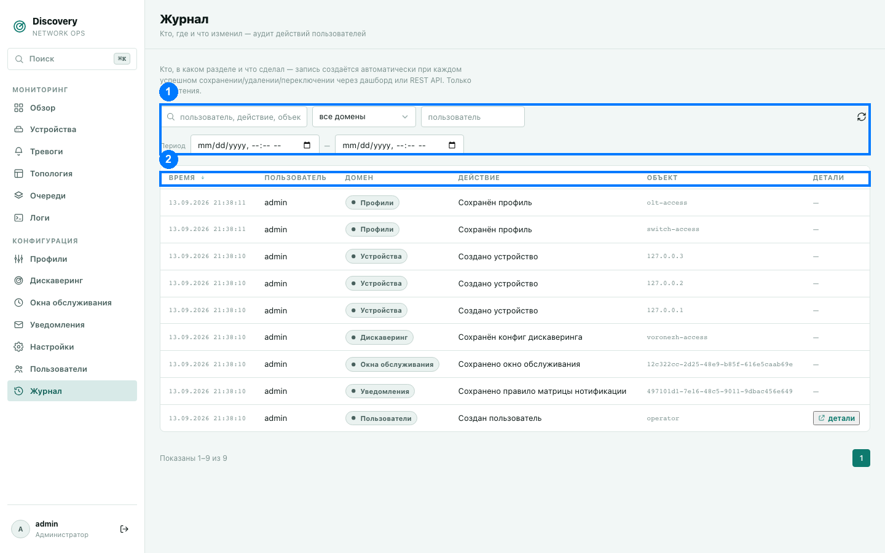

# Журнал

Полный аудит-трейл: кто, когда, в каком разделе и что именно изменил. Раздел виден
только администраторам и полностью **только для чтения** — записи создаются автоматически
самой системой при каждом успешном сохранении, удалении или переключении через дашборд
или напрямую через REST API. Вручную создать, изменить или удалить запись журнала
нельзя.

1. Панель фильтров · 2. Заголовки столбцов

## Что попадает в журнал

Любое успешное изменяющее действие — примеры реальных формулировок, которые вы увидите
в столбце «Действие»:

- «Создан пользователь» / «Удалён пользователь» / «Изменён admin-флаг пользователя» /
  «Изменена роль пользователя»
- «Создана роль» / «Изменены права роли» / «Удалена роль»
- «Сохранён профиль»
- «Создано устройство» / «Удалено устройство» / «Изменена активность устройства» /
  «Массово изменена активность устройств»
- «Удалена тревога»
- «Изменена пауза очереди» / «Удалена задача очереди»

...и аналогично для остальных разделов — конфигураций дискаверинга, окон обслуживания,
каналов и правил уведомлений, настроек. Только успешные действия попадают в журнал —
неудачная попытка (например, отклонённая из-за нехватки прав или неверных данных) записи
не оставляет.

## Столбцы таблицы (2)

| Столбец | Что означает |
|---|---|
| Время | Когда произошло действие. |
| Пользователь | Кто выполнил действие (логин). |
| Домен | К какому разделу данных относится действие (см. те же домены, что и в правах ролей — [Пользователи](users.md)). |
| Действие | Человекочитаемое описание того, что произошло. |
| Объект | Конкретный объект, которого касалось действие (например, имя профиля или IP устройства), если применимо. |
| Детали | Кнопка «детали» — если для этого действия сохранён более подробный снимок изменения (например, какие именно поля поменялись), открывает его в виде таблицы. Если деталей нет — прочерк. |

## Фильтры (1)

- **Поиск** — по пользователю, действию, объекту, техническому пути запроса.
- **Домен** — фильтр по конкретному разделу данных.
- **Пользователь** — фильтр по конкретному логину.
- **Период** — по умолчанию не ограничен (показывается вся история) — это полноценный
  журнал аудита, а не текущий хвост событий, поэтому сужать период по умолчанию не
  должно.
- **Сортировка** — клик по заголовку столбца «Время»/«Пользователь»/«Домен»/«Действие».

Кнопка «Сбросить фильтры» появляется, как только применён хотя бы один фильтр.

## Хранение

Срок хранения записей журнала настраивается в разделе
[Настройки → Хранение и очистка](settings.md#хранение-и-очистка) — по умолчанию хранится
бессрочно, но можно задать автоматическое удаление записей старше указанного числа
секунд.
