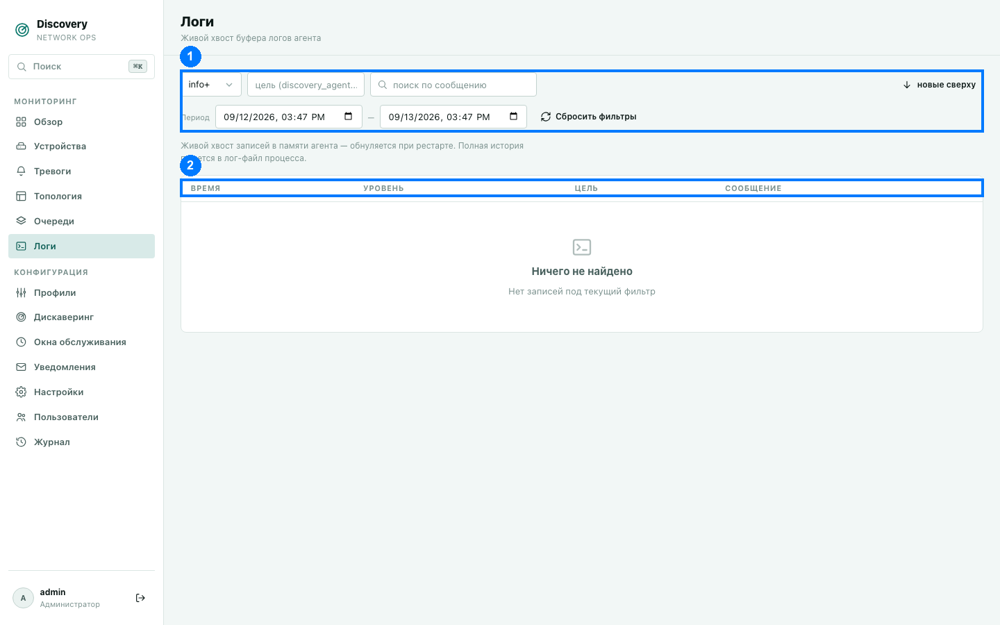

# Логи

Живой хвост технического журнала работы самого discovery — полезно, когда нужно
разобраться, почему что-то не работает так, как ожидается (например, устройство не
опрашивается или тревога не сработала).

1. Панель фильтров · 2. Заголовки столбцов

**Важно:** это лог в памяти процесса — при перезапуске службы он обнуляется. Полная,
постоянная история пишется отдельно в лог-файл на сервере (доступен через
`journalctl -u discovery-agent` для установки через `.deb`/`.rpm`, либо `docker logs`
для установки через Docker) — эта страница показывает только недавние записи для удобной
навигации через браузер, не заменяет файловый лог полностью.

## Уровни записей

От менее к более значимым: `trace`, `debug`, `info`, `warn`, `error`. Фильтр в
выпадающем списке работает по принципу «этот уровень и выше» — например, «warn+»
покажет предупреждения и ошибки, но не обычные информационные записи. По умолчанию
выбран уровень «info+» — самый низкий уровень детализации, который обычно интересен при
повседневной эксплуатации; `debug`/`trace` — для более глубокой технической диагностики,
обычно по запросу поддержки.

## Фильтры (1)

- **Уровень** — как описано выше.
- **Цель** — техническое имя источника записи (например, часть системы вроде
  `discovery_agent::handlers`) — полезно, если вы уже знаете, какая именно подсистема вас
  интересует.
- **Поиск** — по тексту самого сообщения.
- **Период** — по умолчанию последние 24 часа (в отличие, например, от раздела «Тревоги»,
  где по умолчанию период не ограничен — лог по своей природе смотрят «за последнее время»,
  а не листают всю историю с начала времён).
- **Сортировка** (кнопка со стрелкой) — новые сверху (по умолчанию) или старые сверху.
- **Сбросить фильтры** — возвращает все фильтры к значениям по умолчанию.

## Столбцы таблицы (2)

- **Время** — момент записи.
- **Уровень** — цветной бейдж (error — красный, warn — жёлтый, info — синий, остальное —
  нейтральный).
- **Цель** — та же техническая цель, что можно использовать в фильтре.
- **Сообщение** — текст самой записи. Если у записи есть дополнительные структурированные
  данные (например, конкретный IP или ID задачи, к которым относится сообщение) — они
  показаны мелким текстом под самим сообщением в виде пар `имя=значение`.

## Автообновление

Страница обновляется автоматически каждые 3 секунды, пока открыта — специально не чаще,
чтобы не сбивать прокрутку, если вы читаете записи вручную, листая страницы.

## Типичный сценарий использования

Если, например, устройства не появляются после настройки дискaверинга или метрика не
опрашивается — откройте этот раздел, поставьте фильтр «warn+» или «error+» и посмотрите,
не появляются ли записи об ошибках SNMP-опроса, недоступности сети или проблемах
конфигурации в интересующий вас период времени.
