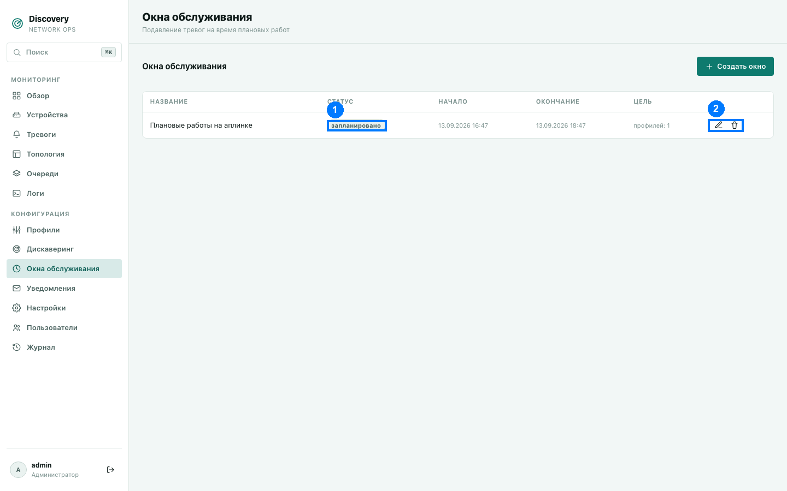
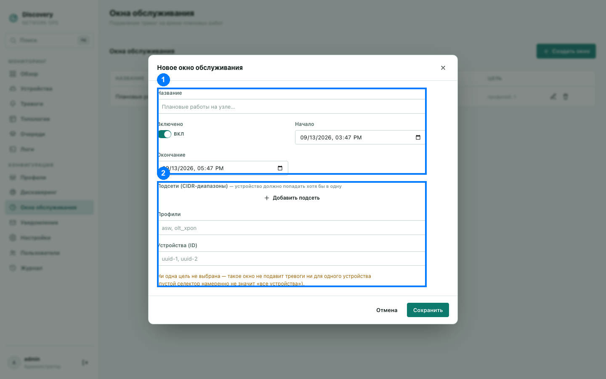

# Окна обслуживания

Плановые работы (перезагрузка коммутатора, замена оборудования, апгрейд прошивки) не
должны сыпать вам тревогами и рассылками, пока вы сами же выполняете работы. Окно
обслуживания подавляет тревоги на заданное время для заданных устройств — без отключения
самого мониторинга целиком.

1. Бейдж статуса · 2. Действия (редактировать, удалить)

## Что именно происходит во время окна обслуживания

Пока окно активно — новые тревоги для попадающих под него устройств **не создаются**, но
уже собранные метрики и история продолжают вестись как обычно (устройство не «слепнет»
для системы). Уже существующая до начала окна активная тревога не подавляется этим окном
задним числом — окно предотвращает появление новых тревог на время работ, а не скрывает
уже случившееся.

## Список окон

| Столбец | Что означает |
|---|---|
| Название | Как вы назвали окно. |
| Статус (1) | «отключено» — окно выключено вручную; «активно» (жёлтый бейдж) — прямо сейчас идёт подавление; «запланировано» — окно включено, но его время ещё не наступило или уже прошло. |
| Начало / Окончание | Дата и время действия окна. |
| Цель | Краткая сводка, чего касается окно — сколько подсетей/профилей/конкретных устройств выбрано. |

Действия (2): **Редактировать** и **Удалить**.

## Форма создания/редактирования

1. Название, включённость и время действия · 2. Таргетинг устройств (со скриншота видно
предупреждение о пустом селекторе, описанное ниже)

### Название, включённость и время действия (1)

- **Название** — произвольное, для вашего удобства (например, «Плановые работы на
  узле…»).
- **Включено** — независимый от времени переключатель. Если работы отменили раньше
  времени или их вообще не будет — можно просто выключить окно, не удаляя его целиком
  (пригодится, если понадобится включить его снова позже с теми же настройками).
- **Начало** и **Окончание** — точные дата и время. Окно действует **включительно** с
  обеих сторон — то есть в самый момент времени начала и в самый момент времени окончания
  окно уже (и ещё) считается активным, без «зазора в одну секунду» на границах.

### На какие устройства действует окно — три способа таргетинга (2)

Можно комбинировать все три способа одновременно — устройство попадает под окно, если
подходит **хотя бы под один** из указанных признаков:

- **Подсети (CIDR-диапазоны)** — устройство должно попадать хотя бы в одну из указанных
  подсетей (IP сети + маска).
- **Профили** (через запятую) — устройство должно быть на одном из перечисленных
  профилей мониторинга.
- **Устройства (ID)** (через запятую) — точный список конкретных устройств. Устройство
  из этого списка попадает под окно **независимо** от того, подходит ли оно под указанные
  выше подсети или профили — это самый точный и всегда работающий способ таргетинга.

**Важно:** если не заполнить ни одного из трёх полей — окно не будет подавлять тревоги
**ни для одного** устройства. Пустой список здесь намеренно не означает «все устройства»
— форма явно предупредит об этом жёлтым текстом, если вы попытаетесь сохранить окно без
единой указанной цели.
