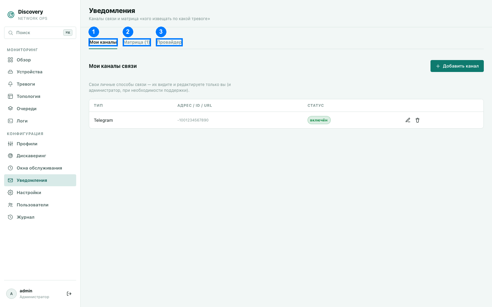

# Уведомления

Раздел состоит из трёх вкладок: личные каналы связи, матрица «кого извещать по какой
тревоге» и общие настройки инфраструктуры доставки (SMTP/Telegram).

1. Мои каналы (открыта на скриншоте) · 2. Матрица · 3. Провайдер

## Вкладка «Мои каналы» (1)

Ваша личная точка связи — куда именно вам должны приходить уведомления. Каждый
пользователь управляет только своими каналами самостоятельно, без прав администратора
(администратор видит их только при необходимости технической поддержки).

- **Email** — в поле «адрес» указывается обычный email-адрес.
- **Telegram** — в поле указывается `chat_id` вашего диалога с ботом (не username и не
  номер телефона — числовой ID чата).
- **Webhook** — в поле указывается полный URL, на который система будет слать POST-запрос
  при срабатывании тревоги. URL обязан быть обычным `http`/`https`-адресом публичного
  хоста — адреса вида `localhost`, `127.0.0.1` или адреса из частных/служебных диапазонов
  не принимаются (система не должна ходить сама на себя или во внутреннюю сеть по чужой
  просьбе). Дополнительно можно задать **секрет подписи** — если он
  задан, каждый запрос подписывается HMAC-SHA256, подпись передаётся в заголовке
  `X-Discovery-Signature`, что позволяет принимающей стороне убедиться, что запрос
  действительно пришёл от вашей системы discovery, а не от кого-то ещё.

Каждый канал можно включить/выключить независимо (например, временно приглушить
Telegram, пока вы в отпуске, не удаляя и не перенастраивая его заново).

**Лимит в пробном периоде:** пока действует бесплатный автоматический пробный период (см.
[Лицензирование и пробный период](../licensing.md)), можно создать не более 1 канала
уведомлений на всю систему — лимит общий на всех пользователей, а не по одному на
каждого.

## Вкладка «Матрица» (2)

Правила «кого извещать по какой тревоге» — задаются администратором, определяют, кто
получит уведомление и при каких условиях.

- **Название** — произвольное, для удобства (например, «Дежурный на критичные»).
- **Включено** — можно временно выключить правило, не удаляя его.
- **Минимальный уровень** — уведомлять при этом уровне серьёзности тревоги и выше
  (Info/Warning/Critical).
- **При активации тревоги** / **При закрытии тревоги** — два независимых переключателя:
  можно настроить уведомление только на появление проблемы, только на её решение, либо и
  на то, и на другое.

**Таргетинг устройств** — те же способы, что и в
[Окнах обслуживания](maintenance-windows.md#на-какие-устройства-действует-окно--способы-таргетинга-2)
(подсети / профили, можно комбинировать; точечное наведение на одно устройство —
подсеть `/32`) — **но с
противоположным поведением пустого селектора**: если не заполнить ни одного из полей —
правило сработает **для всех устройств**. Форма явно показывает это пояснение
при пустом селекторе, чтобы не перепутать с логикой окон обслуживания. (Поле «Устройства
(ID)» — точный список UUID — как и в Окнах обслуживания, убрано из формы 2026-09-20 и
задаётся через REST API; уже сохранённые правила продолжают его учитывать.)

**Время суток и дни недели** — необязательное ограничение: правило действует только в
заданном окне времени (в UTC, не в местном времени сервера) и/или только в выбранные дни
недели. Пустое время — «весь день». Пустой список дней — «каждый день». Полезно,
например, чтобы не будить дежурного ночью по некритичным тревогам, оставив это на утро.

**Получатели** — отметьте конкретных пользователей и/или целые роли. Роль в этом списке —
не отдельная сущность, а удобный способ не перечислять людей поимённо: в момент
срабатывания система подставляет **текущий** состав роли, а не тех, кто состоял в ней на
момент сохранения правила — добавили нового человека на роль «Дежурный» после того, как
правило уже настроено, он начнёт получать уведомления по этому правилу автоматически, без
повторного сохранения правила. Уведомление уйдёт на **все включённые каналы** каждого
получившегося пользователя (если у человека настроены и email, и Telegram — придёт в оба,
если оба включены); если один и тот же человек попал в список и напрямую, и через роль —
дублирующихся уведомлений не будет.

## Вкладка «Провайдер» (3)

Общие технические настройки самой доставки — один SMTP-сервер и один Telegram-бот на всю
систему, которые использует каждый Email- и Telegram-канал соответственно. Настраивается
администратором один раз.

- **SMTP-хост**, **SMTP-порт**, **SMTP-логин**, **SMTP-пароль**, **Адрес отправителя** —
  реквизиты вашего почтового relay-сервера для отправки email-уведомлений. Пароль
  хранится в зашифрованном виде — для этого на сервере должен быть настроен
  `DISCOVERY_SECRET_KEY` (см. [Справочник конфигурации](../configuration.md)); без него
  запрос на сохранение пароля завершается ошибкой `HTTP 500` — секрет не записывается ни
  в открытом, ни в повреждённом виде.
- **Telegram bot token** — токен вашего Telegram-бота (полученный от @BotFather при
  создании бота), через которого будут отправляться сообщения во все Telegram-каналы
  пользователей. Тоже хранится зашифрованным, с тем же требованием к
  `DISCOVERY_SECRET_KEY`.

Без заполненных настроек провайдера соответствующий тип каналов (Email/Telegram) не
сможет реально доставлять сообщения, даже если у пользователей уже настроены свои
персональные каналы этого типа.
