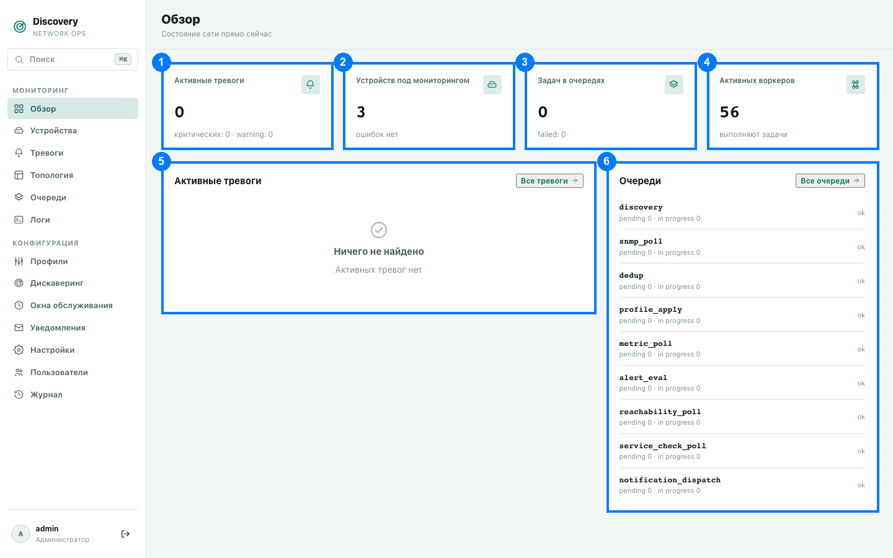

# Обзор

Первая страница после входа — сводка состояния всей вашей сети на текущий момент. Данные
обновляются автоматически каждые 5 секунд, без необходимости перезагружать страницу.

1. Активные тревоги · 2. Устройств под мониторингом · 3. Задач в очередях ·
4. Активных воркеров · 5. Панель «Активные тревоги» · 6. Панель «Очереди»

## Четыре плитки сверху (1–4)

Каждая плитка кликабельна — переносит вас на соответствующий раздел.

**1. Активные тревоги.** Количество тревог, которые сработали и ещё не сняты (то есть
проблема, по мнению системы, всё ещё актуальна). Под числом — разбивка по двум самым
серьёзным уровням: `критических: N · warning: N`. Клик по плитке ведёт в раздел «Тревоги»,
уже отфильтрованный только на активные — не весь список за всё время, а именно то, что
требует внимания прямо сейчас.

**2. Устройств под мониторингом.** Общее число устройств, добавленных в систему (вручную или
через дискaверинг), независимо от того, отвечают ли они сейчас. Под числом — либо «ошибок
нет», либо «с ошибками: N», если у каких-то устройств зафиксирована ошибка опроса. Клик
ведёт в раздел «Устройства».

**3. Задач в очередях.** Суммарное количество задач, ожидающих обработки или уже
обрабатываемых, по всем очередям сразу (сложение `pending` + `in progress` каждой
очереди). Под числом — `failed: N`, если есть задачи, упавшие с ошибкой хотя бы один раз.
Клик ведёт в раздел «Очереди».

**4. Активных воркеров.** Сколько фоновых обработчиков прямо сейчас заняты выполнением
задачи (не простаивают). Под числом — «выполняют задачи» или «простаивают», если сейчас
нет ни одной активной задачи. Это не общее число воркеров в системе, а именно занятых на
этот момент — число будет скакать вверх-вниз в такт нагрузке, это нормально. Клик тоже
ведёт в «Очереди».

## Панель «Активные тревоги» (5)

Список последних 10 активных тревог (если тревог активно больше — остальные видны только
в полном разделе «Тревоги», по ссылке «Все тревоги» в правом верхнем углу панели). Если
активных тревог нет — вместо списка показывается заметный знак «✓ Активных тревог нет»,
как на скриншоте выше.

Каждая строка списка — это:
- цветной бейдж уровня серьёзности (см. ниже),
- имя тревоги и IP устройства, которое её вызвало,
- текст сообщения тревоги (то, что задано в профиле при настройке правила),
- время последнего обновления справа, в формате `ДД.ММ ЧЧ:ММ`.

Клик по любой строке ведёт в тот же отфильтрованный список активных тревог, что и клик по
плитке «Активные тревоги» наверху.

**Уровни серьёзности** (бейдж): `Critical` (красный, «критическая» — что-то серьёзное:
устройство недоступно, критичный порог превышен), `Warning` (жёлтый, предупреждение — не
критично, но заслуживает внимания), всё остальное отображается как `info` (нейтральный
цвет).

## Панель «Очереди» (6)

Список всех очередей обработки системы с текущим состоянием каждой. Ссылка «Все очереди»
в правом верхнем углу ведёт в полноценный раздел «Очереди» с гораздо более подробной
информацией (список воркеров, история и т.д. — см.
[Очереди](queues.md)).

Каждая строка — это название очереди (техническое, латиницей — `discovery`, `snmp_poll` и
т.д.) и число задач `pending`/`in progress` под ним. Справа — либо зелёная надпись `ok`
(нет упавших задач), либо красный бейдж `failed N`, если в этой очереди есть задачи,
завершившиеся с ошибкой хотя бы один раз.

Что означает каждая из 10 очередей — подробно расписано в разделе
[Очереди](queues.md), здесь только суть: система обрабатывает каждое устройство
через цепочку этапов — «найти» → «опросить по SNMP» → «определить профиль» → «опрашивать
метрики» → «проверять тревоги», плюс отдельно и независимо «проверять доступность (ping)»,
«проверять сервисы (TCP/HTTP/SSH)» и «отправлять уведомления». У каждого этапа — своя
очередь и свой пул фоновых обработчиков.

## Что означает пустой дашборд после первой установки

Если вы только что установили систему — все четыре плитки будут показывать нули или
прочерки, а панели — «Активных тревог нет» и пустой (или почти пустой) список очередей.
Это ожидаемое состояние: устройства не появляются сами по себе, пока не настроен хотя бы
один профиль и одна конфигурация дискaверинга — см.
[Установка](../installation.md#первая-настройка-увидеть-первое-устройство).
