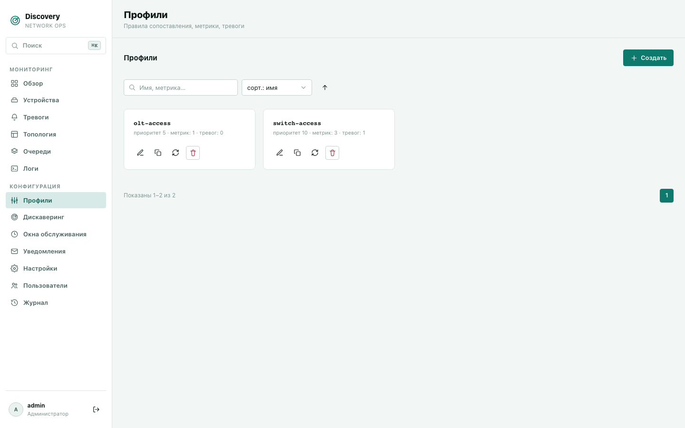
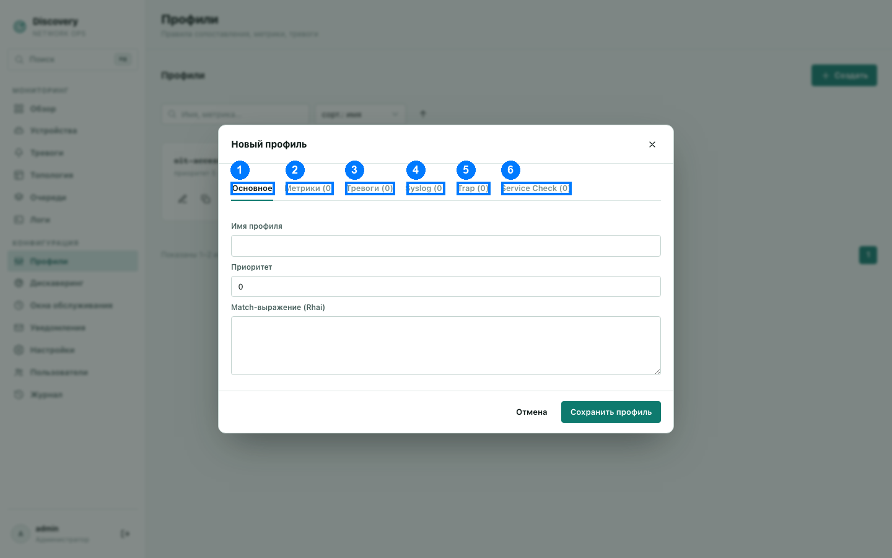

# Профили

Профиль — центральная настройка системы: правило «каких устройств это касается» плюс всё,
что с этими устройствами нужно делать — какие метрики опрашивать, какие тревоги
проверять, какие push-события (syslog/SNMP trap) распознавать, какие сервисы проверять
на доступность. Один профиль применяется сразу ко всем подходящим под него устройствам.

## Список профилей

Каждая карточка — один профиль: имя, приоритет, число метрик и тревог. Действия на
карточке:

- **Изменить** (карандаш) — открыть профиль на редактирование.
- **Клонировать** (копия) — создать новый профиль с теми же настройками под другим
  именем — удобно, когда нужен почти такой же профиль с парой отличий.
- **Синхр. устройства** (⟳) — сбросить ручные переопределения отдельных метрик у **всех**
  устройств на этом профиле обратно к настройкам самого профиля.
- **Удалить** (корзина).

**Поиск** — по имени профиля и именам его метрик. **Сортировка** — по имени или по
приоритету.

**Приоритет** определяет порядок проверки: чем выше число, тем раньше этот профиль
проверяется на соответствие устройству. Если устройство подходит сразу под несколько
профилей — применяется тот, что проверился первым (с более высоким приоритетом).

**Лимит в пробном периоде:** пока действует бесплатный автоматический пробный период (см.
[Лицензирование и пробный период](../licensing.md)), можно создать не более 2 профилей.
При достижении лимита создание нового профиля отклоняется с понятным сообщением.

## Форма создания/редактирования — 6 вкладок

Открывается кнопкой «Создать» (список) или «Изменить»/«Клонировать» на карточке. Изменения
вступают в силу после сохранения — на следующем цикле применения настроек (обычно
несколько секунд).

1. Основное · 2. Метрики · 3. Тревоги · 4. Syslog · 5. Trap · 6. Service Check —
открыта вкладка 1, остальные пять описаны ниже без отдельных скриншотов (интерфейс
идентичен: список карточек-строк + кнопка добавления).

### Вкладка «Основное» (1)

- **Имя профиля** — уникальное имя. У уже существующего профиля изменить нельзя — если
  нужно другое имя, используйте «Клонировать» и создайте копию под новым именем.
- **Приоритет** — см. выше.
- **Match-выражение (Rhai)** — условие, определяющее, каким устройствам подходит этот
  профиль. Пишется на встроенном языке выражений Rhai, с доступом к уже известным данным
  об устройстве через `facts` (базовые факты — например `facts.ip`) и `metrics` (уже
  опрошенные метрики других профилей/этапа обнаружения). Примеры:
  - `true` — подходит вообще всем устройствам.
  - `metrics.vendor.contains("Cisco")` — только устройствам, у которых метрика `vendor`
    содержит «Cisco».
  - `facts.sys_descr.contains("OLT")` — только устройствам, чьё системное описание
    содержит «OLT».

### Вкладка «Метрики» (2)

Список того, что опрашивается на устройствах этого профиля. Для каждой метрики:

- **Имя метрики** — ключ, на который можно ссылаться как `metrics.<имя>` в сообщениях
  тревог и в Rhai-выражениях всего профиля.
- **Источник** — `snmp` (обычный SNMP get/walk по OID) или `ssh (команда)` (значение —
  вывод команды, выполненной по SSH-сессии устройства; для этого у устройства должны быть
  заданы [SSH-креды](devices.md#действия-в-конце-строки)). SSH-метрика всегда одиночное
  значение, без табличной формы.
- **OID и тип** (для источника `snmp`) — сам OID и его вид: одиночное значение (скаляр)
  или таблица (например, таблица портов) — если таблица, ниже появляется редактор колонок
  (автоматически по всем полям записи, либо вручную — конкретные подполя с именами).
- **Команда** (для источника `ssh`) — сама команда, выполняется как есть в SSH-сессии.
- **Частота опроса** — по умолчанию (общий интервал из настроек), либо своя: период в
  секундах, либо расписание по календарю (месяцы, даты, время).
- **Хранить историю, сек** — на сколько хранить историю значений именно этой метрики.
  Пусто — хранить бессрочно.
- **Производная метрика** (только для скалярной SNMP-метрики) — если метрика является
  накопительным счётчиком (например, счётчик переданных байт), можно попросить систему
  автоматически вычислить из него **rate** (изменение в секунду) или **delta** (изменение
  за один опрос без нормализации по времени) как отдельную метрику `<имя>_rate` /
  `<имя>_delta`, доступную во всех выражениях так же, как обычная метрика.
- **Хранить крайнюю удачную всегда** / **хранить самую крайнюю запись всегда** —
  два независимых чекбокса, защищающих последнее успешное значение и/или самую последнюю
  запись (даже неудачную) от удаления по истечении срока хранения истории.

Кнопки «Экспорт»/«Импорт» позволяют выгрузить весь список метрик в JSON-файл и загрузить
обратно (например, в другой профиль) — импорт заменяет метрики с совпадающими именами, не
затрагивая остальные.

### Вкладка «Тревоги» (3)

Правила проверки условий. Для каждого правила:

- **Имя** — уникальное в рамках профиля, отображается в списке [Тревог](alerts.md).
- **Уровень** — `info`/`warning`/`critical`.
- **Табличная метрика (тревога по строке)** — если оставить пустым, правило проверяется
  один раз на устройство целиком. Если выбрать одну из табличных метрик профиля — правило
  проверяется отдельно для каждой строки этой таблицы (например, отдельная тревога на
  каждый порт), и в выражениях становится доступна переменная `row`.
- **Ключ идентичности строки (Rhai)** (только если выбрана табличная метрика) — выражение,
  определяющее, какие строки считать «той же самой» тревогой между опросами (по умолчанию
  — собственный индекс строки).
- **Условие активации (Rhai)** — например `metrics.cpu_load > 90` (обычное правило) или
  `row.ifOperStatus == 2` (правило по строке).
- **Условие деактивации (Rhai)** — отдельное условие снятия тревоги. Если оставить
  пустым — используется отрицание условия активации, но тогда гистерезис недоступен (см.
  ниже).
- **Facts-выражение (Rhai)** — что сохранить как «снимок» данных в момент активации
  именно этой тревоги, например `#{ip: facts.ip, cpu: metrics.cpu_load}`. Пусто — ничего
  не сохранять.
- **Сообщение** — текст тревоги, поддерживает подстановки вида `{metrics.имя}`,
  `{facts.ip}` и (для правил по строке) `{row.имя}`.
- **Держать условие деактивации истинным столько секунд перед снятием** — это и есть
  механизм **гистерезиса** (анти-флаппинга): тревога не снимается мгновенно в момент,
  когда условие деактивации впервые стало истинным — оно должно оставаться истинным
  непрерывно указанное число секунд. Это защищает от ситуации, когда один-единственный
  пропущенный/запоздавший опрос закрывает и тут же снова открывает тревогу.
- **Задержка активации, секунд** — тревога откроется только если условие активации
  остаётся истинным непрерывно указанное время; краткий выброс не создаёт инцидент.
- **Окно flapping, секунд** и **порог flapping, переключений** — сколько переходов между
  зонами считать flapping. Пока порог достигнут в окне, activation/recovery уведомления
  подавляются, а причина и состояние доступны в тревоге.

Кнопки «Экспорт»/«Импорт» работают так же, как у метрик.

### Вкладка «Syslog» (4)

Настройка push-приёма syslog-сообщений от устройств — отдельный механизм от обычного
активного опроса: устройство само присылает сообщение, система его разбирает и
сопоставляет с одним из заданных здесь «биндингов».

**Прежде чем настраивать биндинги здесь** — приём syslog по умолчанию выключен на уровне
всего сервера (не только этого профиля) и включается отдельно, через `config.toml` с
перезапуском процесса — см. [Справочник конфигурации](../configuration.md#snmp_trap-и-syslog--приём-snmp-trap-и-syslog).
Биндинги без включённого слушателя сохранятся, но никогда не сработают — сообщениям
просто неоткуда взяться.

Каждый биндинг:
- **Имя биндинга** — на устройстве появится метрика `metrics.syslog_<имя>`.
- **TTL строки, сек** — сколько строка может не обновляться, прежде чем считается
  «Утеряна» (это тот же статус, что используется для утерянных строк тревог — см.
  [Тревоги](alerts.md#статус-утеряна--не-то-же-самое-что-закрыта)). Пусто — никогда не
  устаревает по этой причине.
- **Хранить историю, сек**.

Внутри биндинга — один или несколько **вариантов** формата сообщения (полезно, если одно
устройство присылает сообщения об одном и том же в разных форматах):
- **Regex-паттерн** — регулярное выражение, проверяется против тела syslog-сообщения (без
  заголовка). Именованные группы вида `(?P<имя>...)` становятся отдельными полями строки.
- **Severity ≤** — фильтр по критичности сообщения (0 = emerg, самое серьёзное, до 7 =
  debug); чем меньше число, тем серьёзнее. Пусто — любая критичность подходит.
- **Facility =** — фильтр по источнику согласно стандарту syslog (0 = kernel, 3 = daemon,
  16–23 = local0–7 и т.п.). Пусто — любой источник.
- **Ключ идентичности строки (Rhai)** — как определить, какая строка (запись) это —
  например `fields.ifName`, если сообщение относится к конкретному порту. Пусто — единая
  запись без разделения по сущностям.

### Вкладка «Trap» (5)

То же самое, что «Syslog», но для приёма **SNMP Trap** — push-уведомлений по протоколу
SNMP, а не по syslog. Та же оговорка про предварительное включение слушателя в
`config.toml` — см. [Справочник конфигурации](../configuration.md#snmp_trap-и-syslog--приём-snmp-trap-и-syslog).

Каждый биндинг — метрика `metrics.trap_<имя>`, с теми же полями TTL/хранения истории.
Внутри — варианты:
- **Trap OID** — с каким `snmpTrapOID` (SNMP v2c/v3) или нормализованным
  enterprise+generic+specific (SNMP v1) сравнивать пришедший трап.
- **Варбинды** — список пар «имя поля → OID варбинда из пакета трапа» — то есть какие
  конкретно данные из тела трапа сохранить и как их назвать. Берутся только реальные
  данные из полученного пакета, без придуманных значений.
- **Ключ идентичности строки (Rhai)** — например `varbinds.if_index`, аналогично Syslog.

### Вкладка «Service Check» (6)

Проверки доступности на уровне TCP/HTTP(S)/SSH — независимо от SNMP. Результат всех
чеков профиля собирается в одну табличную метрику `metrics.service_checks` (одна строка
на чек).

Общие для всех чеков профиля настройки:
- **Частота опроса** — по умолчанию либо своё расписание (период/календарь), как у
  метрик.
- **Хранить историю, сек**.

Каждый отдельный чек:
- **Имя** — уникальный в рамках профиля ключ строки в общей таблице.
- **Протокол** — `tcp` (просто попытка соединения), `http`/`https` (запрос с опциональной
  проверкой статус-кода и содержимого ответа), `ssh` (соединение + аутентификация, без
  выполнения какой-либо команды).
- **Target** — хост/IP для проверки. Пусто — используется собственный IP устройства.
- **Порт** — TCP-порт.
- **Таймаут, мс** — пусто — используется дефолт (2 секунды).
- Для `http`/`https` дополнительно: **Path** (пусто = `/`), **Ожидаемый статус** (пусто =
  любой ответ 2xx считается успехом), **Тело содержит** (пусто = тело ответа вообще не
  запрашивается — проверяется только сам факт ответа с нужным статусом).

## Как профиль применяется к устройству

Сохранение профиля — это «upsert» по имени: если профиль с таким именем уже есть, он
обновляется; иначе создаётся новый. Изменения подхватываются не мгновенно на всех
устройствах, а на очередном цикле применения (обычно занимает несколько секунд после
сохранения) — если устройство уже имеет ручные переопределения отдельных метрик, эти
переопределения не сбрасываются автоматически при изменении профиля, только явной
кнопкой «Синхр.» на карточке профиля или «Синхронизировать» на конкретном устройстве в
разделе [Устройства](devices.md#действия-в-конце-строки).
