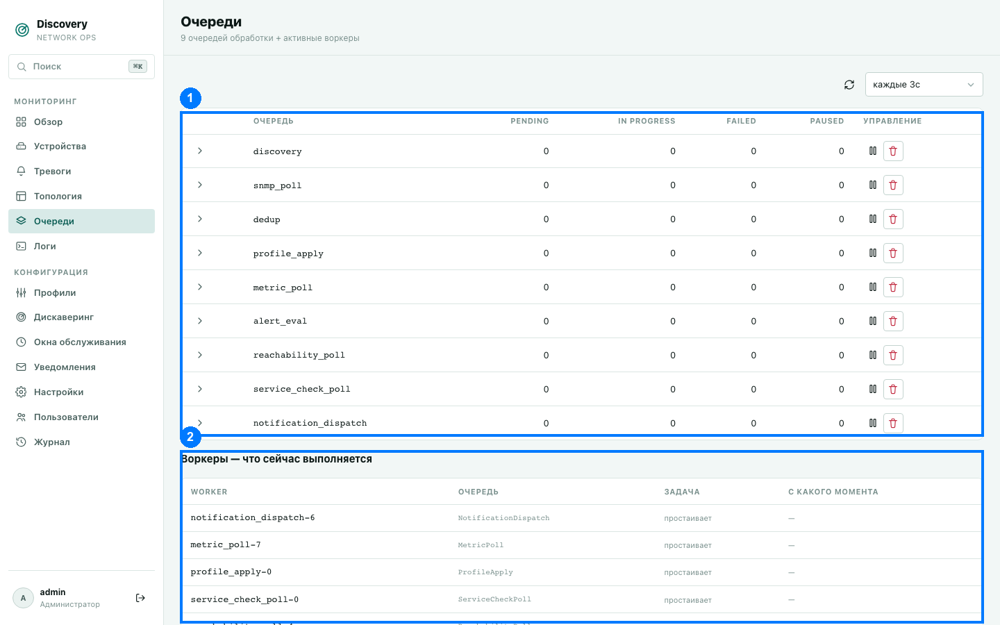

# Очереди

Раздел «Очереди» показывает внутреннюю кухню обработки: как устройство проходит путь от
«обнаружено» до «метрики опрошены, тревоги проверены», и что происходит с этой обработкой
прямо сейчас. Полезен в первую очередь для диагностики — если что-то работает не так, как
ожидается, здесь видно, застряла ли обработка на каком-то этапе.

1. Таблица очередей · 2. Воркеры — что сейчас выполняется

## Как устроена обработка устройства

Каждое устройство проходит через цепочку этапов, и у каждого этапа — своя очередь задач и
свой независимый пул фоновых обработчиков («воркеров»). Медленный этап не может
«заглушить» быстрый — у них разная, независимо настраиваемая пропускная способность.

| Очередь | Что делает |
|---|---|
| **discovery** | Первый этап: кандидат-адрес приходит из сканирования подсети — дешёвая проверка, отвечает ли он вообще. |
| **snmp_poll** | Опрос базовой SNMP-идентичности устройства (sysObjectID, sysDescr, sysName и т.п.) — повторяется регулярно, не разово: модель/прошивка устройства может со временем измениться (замена оборудования, ремонт), и это должно быть учтено. |
| **dedup** | Определение (или переопределение) итоговой идентичности устройства и подбор подходящего профиля мониторинга под свежие данные. |
| **profile_apply** | Сравнение подобранного профиля с уже применённым — реальное применение настроек и (пере)запуск опроса метрик происходит, только если профиль реально изменился. |
| **metric_poll** | Регулярный сбор метрик согласно назначенному профилю — то, что вы видите в развёрнутой строке устройства на странице «Устройства». |
| **alert_eval** | Проверка условий тревог из профиля против свежесобранных метрик. |
| **reachability_poll** | Независимая регулярная проверка доступности (ping + SNMP) — это именно та проверка, что показывается как колонки «Ping»/«SNMP» на странице «Устройства». Работает независимо от того, подошёл ли устройству вообще какой-то профиль. |
| **service_check_poll** | Проверки доступности сервисов (TCP-порт, HTTP(S)-статус, SSH-баннер) — только если такие проверки заданы в профиле устройства. |
| **notification_dispatch** | Отправка одного уведомления в один канал связи (email/Telegram/webhook) — см. [Уведомления](notifications.md). Одна задача — одна попытка доставки в один конкретный канал, чтобы сбой доставки в одном канале не повлиял на уже успешно отправленные в другие. |
| **topology_recompute** | Пересчёт связей топологии одного устройства — запускается не по расписанию, а сразу после того, как у устройства обновилась метрика, влияющая на правило топологии. См. [Топология](topology.md). |

## Таблица очередей (1)

| Столбец | Что означает |
|---|---|
| Очередь | Техническое имя (см. таблицу выше). Бейдж «на паузе» — вся очередь целиком приостановлена (см. ниже). |
| Pending | Сколько задач ожидает обработки. |
| In progress | Сколько задач обрабатывается прямо сейчас. |
| Failed | Сколько задач завершились с ошибкой хотя бы один раз (красный бейдж, если больше нуля). Задача с ошибкой не пропадает — система повторяет попытку по своему графику до исчерпания лимита попыток. |
| Paused | Сколько отдельных задач приостановлено индивидуально (независимо от того, стоит ли на паузе вся очередь). |
| Управление | Пауза/возобновление всей очереди целиком, полная очистка очереди. |

Клик по стрелке слева от названия очереди раскрывает список конкретных задач внутри неё
(см. ниже).

**Пауза очереди** — временно останавливает забор новых задач именно из этой очереди
(остальные продолжают работать в обычном режиме). Полезно, например, если конкретный этап
ведёт себя нестабильно и нужно время на диагностику, не отключая весь мониторинг целиком.

**Очистить очередь** — необратимо удаляет вообще все задачи из очереди (и pending, и
failed). Система запрашивает подтверждение перед этим действием.

## Панель задач внутри очереди

Разворачивание строки очереди показывает список отдельных задач с фильтрами (поиск по
ID/данным/тексту ошибки, по состоянию — pending/in_progress/failed) и сортировкой.

| Столбец | Что означает |
|---|---|
| ID | Числовой идентификатор задачи. |
| Состояние | Бейдж состояния: pending (нейтральный), in_progress (синий), failed (красный). Пометка «пауза» — задача приостановлена индивидуально. |
| Данные | Сырые технические данные задачи (например, ID устройства, которого касается задача) — в основном для диагностики. |
| Попытки | Сколько раз задача уже пыталась выполниться из максимально разрешённого числа попыток. |
| Ошибка | Текст последней ошибки, если задача хоть раз падала. |
| Обновлено | Когда состояние задачи менялось в последний раз. |

**Действия над отдельной задачей** — приостановить/возобновить именно эту задачу (не
трогая остальные в очереди), либо удалить её насовсем.

## Воркеры — что сейчас выполняется (2)

Отдельная таблица под списком очередей — какие фоновые обработчики существуют прямо
сейчас и чем заняты: имя воркера, какую очередь он обслуживает, краткое описание текущей
задачи (или «простаивает», если свободен), с какого момента он в этом состоянии. Это то
же число, что показывает плитка «Активных воркеров» на странице «Обзор», но здесь видно
персонально по каждому воркеру, а не только суммарно.

## Автообновление

По умолчанию страница не обновляется сама (без автообновления, поскольку это
живая операторская консоль загрузки, а не дежурный экран). Период можно включить (от «без
автообновления» до раза в секунду) в выпадающем списке над таблицей, либо обновить
немедленно кнопкой с иконкой ⟳.
## Очередь операторских действий

Очередь operator_action обслуживает явные действия над устройством: test, poll-now,
rediscover и backup. Она сохраняет статус, результат и причину ошибки для оператора,
ограничивает параллельные действия по одному устройству и не хранит в открытом виде
конфигурацию или секреты.
