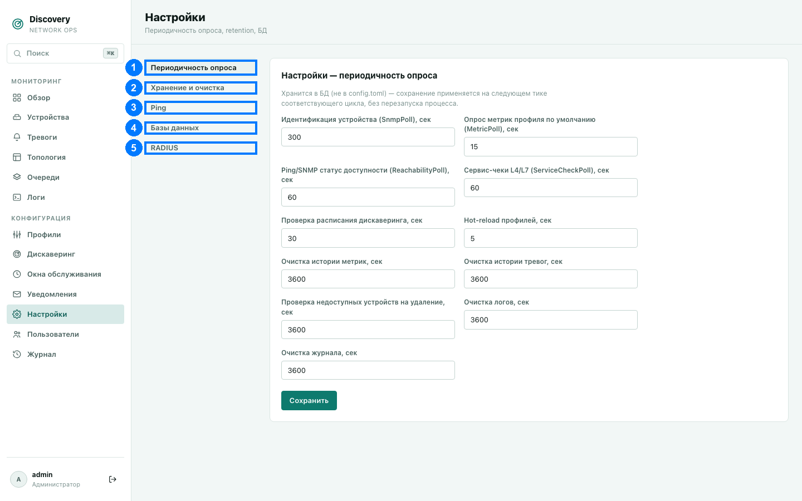

# Настройки

Раздел «Настройки» — четыре группы параметров работы самой системы: как часто что-то
опрашивается, сколько хранить историю, параметры проверки доступности и подключения к
базам данных.

1. Периодичность опроса · 2. Хранение и очистка · 3. Ping · 4. Базы данных

**Важное различие:** большинство настроек здесь хранятся в базе данных и применяются
«на лету» — на следующем тике соответствующего фонового цикла, без перезапуска процесса.
Настройки баз данных (последняя вкладка) — исключение: они хранятся в файле `config.toml`
на сервере и **требуют перезапуска процесса**, чтобы вступить в силу. Об этом системе
известно сама — при сохранении настроек БД появляется заметный баннер с кнопкой
«Перезапустить сейчас» (или «Позже», если хотите применить изменения при следующем
плановом перезапуске).

## Периодичность опроса (1)

Как часто запускается каждый из фоновых циклов обработки (см. также
[Очереди](queues.md), где видно текущую загрузку каждого из них):

| Настройка | Что означает |
|---|---|
| Идентификация устройства (SnmpPoll) | Как часто переопределяется модель/вендор устройства по SNMP. |
| Опрос метрик профиля по умолчанию (MetricPoll) | Базовый период опроса метрик — конкретная метрика профиля может задать своё собственное расписание поверх этого значения. |
| Ping/SNMP статус доступности (ReachabilityPoll) | Проверка «жив ли» устройство отдельно от опроса его метрик. |
| Сервис-чеки L4/L7 (ServiceCheckPoll) | Период по умолчанию для TCP/HTTP(S)/SSH-проверок из профиля — тоже может быть переопределён в самом профиле. |
| Проверка расписания дискаверинга | Как часто система проверяет, не пора ли запустить какую-то конфигурацию дискаверинга по её расписанию — это не то же самое, что периодичность самого сканирования. |
| Hot-reload профилей | Как часто перечитываются файлы профилей с диска без перезапуска процесса. |
| Очистка истории метрик / тревог / логов / журнала | Как часто запускается удаление устаревших записей сверх срока хранения (см. следующий раздел). |
| Проверка недоступных устройств на удаление | Как часто проверяется условие автоматического удаления устройств, которые давно недоступны. |

Все значения — в секундах.

## Хранение и очистка (2)

Четыре независимые карточки, каждая со своей кнопкой «Сохранить»:

- **Хранение тревог** — сколько хранить уже **снятые** тревоги после снятия. Активные
  тревоги не удаляются никогда, независимо от этой настройки. Чекбокс «хранить вечно» —
  по умолчанию включён, поле срока заблокировано, пока он включён.
- **Хранение логов** — то же самое для записей в разделе [Логи](logs.md).
- **Хранение журнала** — то же самое для записей в разделе [Журнал](journal.md).
- **Удаление недоступных устройств** — если устройство непрерывно не отвечает на ping
  дольше указанного времени, оно будет полностью удалено вместе со всей своей историей.
  По умолчанию выключено («никогда не удалять»). Устройства, выключенные вручную (не
  через недоступность, а через переключатель мониторинга), никогда не удаляются
  автоматически, независимо от этой настройки.

## Ping (3)

Периодичность самой проверки задаётся в разделе «Периодичность опроса» выше — здесь
только параметры одной попытки:

- **Таймаут пробы, мс** — сколько ждать ответа на один ICMP-запрос, прежде чем считать
  эту конкретную попытку неудачной.
- **Повторов после первой неудачи** — сколько раз повторить попытку, прежде чем
  окончательно считать устройство недоступным в этом цикле.

## Базы данных (4)

**Требует перезапуска процесса после сохранения.**

### Список подключений

Список именованных подключений к базам данных. Если список пуст — это не ошибка: все
домены данных в этом случае работают на внутреннем `sqlite::memory:` (ничего не хранится
между перезапусками, но ничего внешнего настраивать не нужно — режим «просто запустить и
попробовать»).

Для каждого подключения:
- **по умолчанию** (переключатель) — использовать эту БД для любого домена данных, для
  которого явно не выбрана другая БД в разделе «Маршрутизация доменов» ниже.
- **Имя** — произвольное уникальное имя подключения (используется только для
  маршрутизации ниже, не является реальным именем базы данных на сервере).
- **Тип** — `postgres`, `mysql`, `sqlite`, `memory` (временное хранилище в памяти),
  `clickhouse` (можно использовать только для домена «Логи») или `cassandra` (можно
  использовать только для доменов «Метрики устройств»/«Тревоги»).
- Для серверных БД (postgres/mysql/clickhouse/cassandra) — хост, порт (пусто = стандартный
  порт для типа БД), имя базы данных (для Cassandra это называется Keyspace),
  пользователь, пароль (пусто — без аутентификации, где это применимо).
- Для sqlite — путь к файлу (пусто = временное хранилище в памяти, аналогично `memory`) и
  таймаут ожидания при конкурентной записи.
- **Размер пула соединений** — пусто означает использование значения по умолчанию для
  выбранного типа БД.

Кнопки **Добавить БД** и **Клонировать** (на каждой записи) — добавить новое подключение
с нуля или скопировать существующее под другим именем.

### Маршрутизация доменов

Система разделяет данные на 12 независимо маршрутизируемых доменов: устройства, метрики
устройств, тревоги, профили, конфигурации дискаверинга, логи, задачи (очереди), окна
обслуживания, уведомления, топология, групповые тревоги, настройки. Для каждого домена можно выбрать, в какое
из настроенных выше подключений он должен писать данные — либо оставить «(по умолчанию)»,
чтобы использовать БД, отмеченную как основная. Выпадающий список для каждого домена
показывает только те подключения, тип которых вообще совместим с этим доменом (например,
ClickHouse предложится только для домена «Логи»).

Журнал действий ([Журнал](journal.md)) и личные каналы уведомлений пользователей (вкладка
«Мои каналы» в [Уведомлениях](notifications.md)) не маршрутизируются как отдельные домены
— они всегда хранятся там же, где домен «Настройки».
