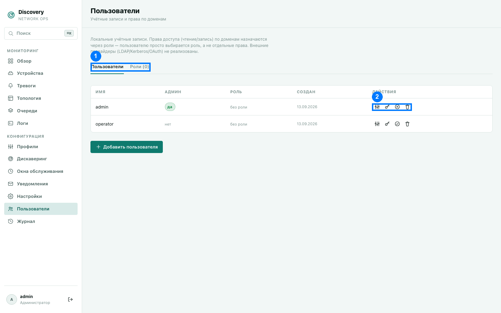
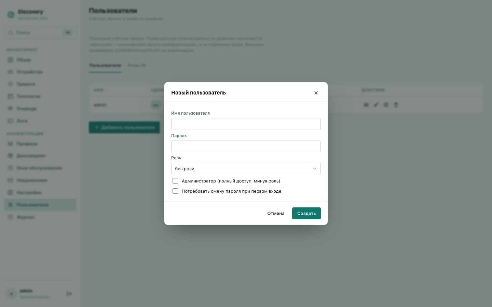
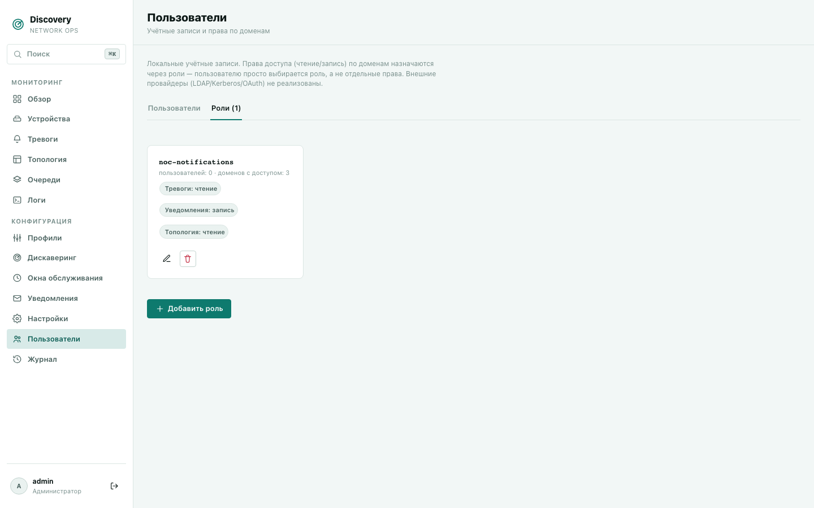
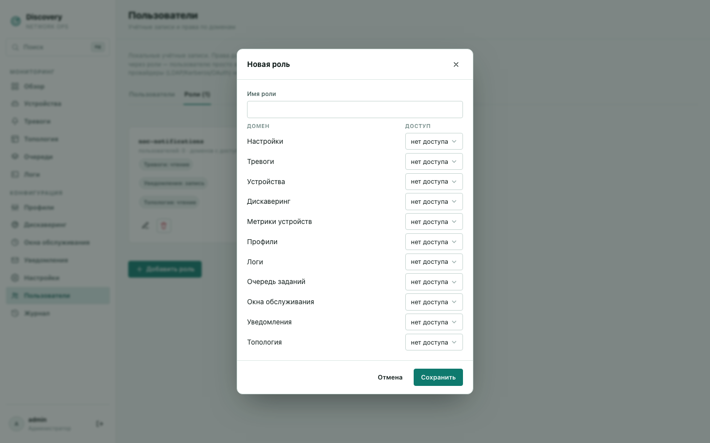

# Пользователи

Управление учётными записями пользователей и их правами доступа. Раздел виден только
администраторам. Локальная аутентификация — внешние провайдеры входа (LDAP/Kerberos/
OAuth) не реализованы, все учётные записи создаются и хранятся внутри самой системы.

1. Вкладки «Пользователи» / «Роли» · 2. Действия строки (роль, пароль, администратор,
удалить)

Раздел состоит из двух вкладок (1): «Пользователи» (учётные записи) и «Роли» (наборы прав).

## Вкладка «Пользователи»

| Столбец | Что означает |
|---|---|
| Имя | Логин для входа. Жёлтый бейдж «смена пароля» — учётная запись ещё не сменила временный/дефолтный пароль; при следующем входе будет показан блокирующий экран смены пароля вместо дашборда. |
| Админ | «да» — пользователь администратор: видит и может менять всё, независимо от назначенной роли (роль в этом случае просто игнорируется). |
| Роль | Имя назначенной роли, или «без роли» (в этом случае у пользователя нет доступа ни к одному домену данных, если только он не администратор). |
| Создан | Дата создания учётной записи. |

Действия в конце строки (2): **назначить роль**, **сбросить пароль** (введите новый пароль
во всплывающем окне), **сделать/снять администратора**, **удалить**.

### Форма создания пользователя

- **Имя пользователя** — логин, должен быть уникальным.
- **Пароль** — можно сменить позже кнопкой «Сбросить пароль».
- **Роль** — необязательно, можно назначить позже.
- **Администратор** — полный доступ ко всему, минуя назначенную роль.
- **Потребовать смену пароля при первом входе** — если включить, при следующем входе
  пользователь увидит блокирующий экран смены пароля вместо дашборда. Полезно, когда вы
  сами придумываете временный пароль для новой учётной записи и хотите, чтобы владелец
  сразу задал свой собственный.

**Лимит в пробном периоде:** пока действует бесплатный автоматический пробный период (см.
[Лицензирование и пробный период](../licensing.md)), можно создать не более 1
пользователя (не считая изначальной учётной записи `admin`, созданной автоматически при
первой установке). При достижении лимита создание нового пользователя отклоняется с
понятным сообщением.

## Вкладка «Роли»

Роль — именованный набор прав по доменам данных. Пользователю назначается одна роль
целиком, а не отдельные права по отдельности — это упрощает управление, если у вас
несколько учётных записей с одинаковым уровнем доступа.

Каждая карточка роли показывает: сколько пользователей сейчас на ней, по скольким
доменам есть хоть какой-то доступ, и краткий список доменов с уровнем доступа
(«чтение»/«запись»).

### Форма создания/редактирования роли

- **Имя роли** — уникальное, отображается в списке пользователей.
- Таблица доступа — для каждого из 12 доменов данных выбирается один из трёх уровней:
  - **нет доступа** — раздел полностью скрыт для пользователей с этой ролью.
  - **чтение** — можно просматривать, нельзя изменять.
  - **запись** — полный доступ, включая изменение.

**Домены данных:** Настройки, Тревоги, Устройства, Конфигурации дискaверинга, Метрики
устройств, Профили, Логи, Задачи (очереди), Окна обслуживания, Уведомления (каналы +
матрица + настройки провайдера), Топология, Групповые тревоги.

Изменение прав роли действует немедленно на всех пользователей, у кого она назначена —
не нужно ничего дополнительно применять или перезапускать.

**Удаление роли, которой кто-то пользуется** — система явно предупредит, сколько
пользователей сейчас на этой роли, перед подтверждением удаления. Сами пользователи при
этом не удаляются — они просто остаются без роли (без доступа ни к одному домену данных),
пока им не назначат другую.
