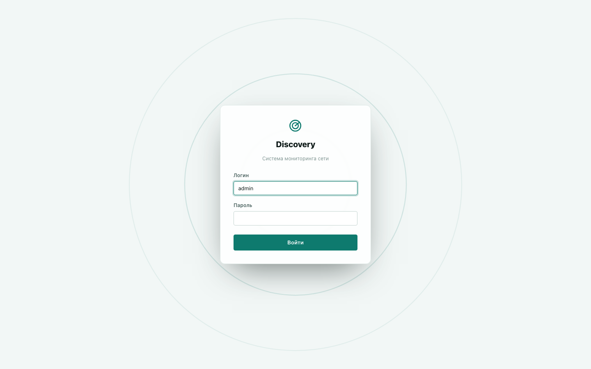

# Установка

Четыре способа установить discovery. Если не уверены — используйте **Вариант 1**: он
проще всего для типичного сервера провайдера и не требует Docker.

## Вариант 1 — нативный пакет (.deb/.rpm) — рекомендуется

Готовый пакет для Debian/Ubuntu (`.deb`) или Fedora/RHEL-семейства (`.rpm`) —
устанавливается одной командой пакетного менеджера, ничего дополнительно ставить не
нужно.

**Debian/Ubuntu:**
```bash
sudo apt install ./discovery-agent.deb
```

**Fedora/RHEL/CentOS Stream:**
```bash
sudo dnf install ./discovery-agent.rpm
```

Пакет сам создаёт системного пользователя, генерирует секретный ключ шифрования и
запускает сервис. Дальше — раздел [«Первый вход»](#первый-вход) ниже.

Расположение после установки:

| Что | Путь |
|---|---|
| Конфигурация | `/etc/discovery-agent/config.toml` |
| Данные (база данных) | `/var/lib/discovery-agent/` |
| Управление сервисом | `systemctl status discovery-agent`, `journalctl -u discovery-agent` |

При первом запуске нужно заранее задать пароль начального администратора. Значения
`admin/admin` по умолчанию нет: сервис не поднимет HTTP-интерфейс, пока не получит
непустой пароль длиной не менее 8 символов через
`DISCOVERY_BOOTSTRAP_ADMIN_PASSWORD`. Пакет создаёт
`/etc/discovery-agent/discovery.env` и на чистой установке не запускает сервис, пока
пароль не задан; после добавления строки ниже сервис можно запустить:

```dotenv
DISCOVERY_BOOTSTRAP_ADMIN_PASSWORD=<одноразовый-пароль-для-первого-входа>
```

Затем перезапустите сервис:

```bash
sudoedit /etc/discovery-agent/discovery.env
sudo systemctl start discovery-agent
```

Не удаляйте существующую строку `DISCOVERY_SECRET_KEY`: она нужна для расшифровки уже
сохранённых секретов и должна переживать обновления.

**Удаление:** `sudo apt remove discovery-agent` (Debian/Ubuntu) останавливает сервис, но
**сохраняет** ваши данные — переустановка ничего не теряет. Полное удаление данных —
`sudo apt purge discovery-agent`. На Fedora/RHEL `sudo dnf remove discovery-agent` всегда
сохраняет данные (у `.rpm`, в отличие от `.deb`, нет отдельного понятия «полное
удаление») — для удаления данных вручную: `sudo rm -rf /var/lib/discovery-agent`.

## Вариант 2 — Docker (Linux/macOS/Windows)

Подходит, если вы уже используете Docker или хотите один и тот же способ установки на
любой ОС.

**Установка Docker**, если ещё не стоит:
- **Linux:** `docker` + `docker-compose-plugin` из пакетного менеджера дистрибутива.
- **macOS/Windows:** [Docker Desktop](https://www.docker.com/products/docker-desktop/).

**Windows:** Docker Desktop должен быть в режиме **Linux containers** — это режим по
умолчанию, ничего переключать не нужно.

```bash
cp .env.example .env
# откройте .env и задайте оба значения:
#   DISCOVERY_SECRET_KEY=<openssl rand -base64 32>
#   DISCOVERY_BOOTSTRAP_ADMIN_PASSWORD=<одноразовый-пароль-длиной-не-менее-8-символов>

# в docker-compose.yml, в environment сервиса discovery-agent, должны быть обе строки:
#   DISCOVERY_SECRET_KEY: ${DISCOVERY_SECRET_KEY:?set DISCOVERY_SECRET_KEY in .env}
#   DISCOVERY_BOOTSTRAP_ADMIN_PASSWORD: ${DISCOVERY_BOOTSTRAP_ADMIN_PASSWORD:?set DISCOVERY_BOOTSTRAP_ADMIN_PASSWORD in .env}

docker compose up -d --build
```

Первый запуск соберёт образ (несколько минут) и поднимет один контейнер — внешних баз
данных не требуется, все данные хранятся в Docker-томе и переживают перезапуск.

Откройте `http://<адрес сервера>:8088`.

## Вариант 3 — вручную из бинарника, без пакетного менеджера (Linux)

Если `.deb`/`.rpm` не подходит под ваш дистрибутив — поставщик может передать отдельно
собранный бинарник (без исходного кода — код продукта закрытый, см.
[README](../README.md)) вместе с systemd-юнитом и инструкцией по размещению — обратитесь к
поставщику, если этот путь вам нужен.

## Вариант 4 — готовый архив для macOS и Windows (самостоятельная загрузка)

Архив с бинарником под вашу ОС и архитектуру — без сборки, без пакетного менеджера и без
Docker. Внутри — `discovery-agent` (или `discovery-agent.exe`), уже настроенный
`config.toml` (SQLite в подкаталоге `./data` рядом с бинарником) и `LICENSE.md`.

1. Распакуйте архив и перейдите в получившийся каталог.
2. Создайте каталог для данных: `mkdir data`.
3. Сгенерируйте секретный ключ (нужен для хранения SNMPv3/SSH-учёток и секретов
   провайдера уведомлений — обычный SNMP v1/v2c-опрос и сам дашборд работают без него):
   ```bash
   openssl rand -base64 32
   ```
4. Запустите, подставив полученный ключ:

   **macOS/Linux:**
   ```bash
   DISCOVERY_SECRET_KEY=<полученный ключ> ./discovery-agent
   ```
   **Windows (PowerShell):**
   ```powershell
   $env:DISCOVERY_SECRET_KEY="<полученный ключ>"; .\discovery-agent.exe
   ```
5. Откройте `http://localhost:8088` — дальше как в «Первый вход» ниже.

**macOS:** при первом запуске Gatekeeper заблокирует бинарник («нельзя открыть, так как
Apple не может проверить автора») — сборка не подписана и не нотаризована у Apple. Снять
блокировку: правый клик на файле → «Открыть» → подтвердить в диалоге, либо один раз
выполнить в терминале:
```bash
xattr -d com.apple.quarantine ./discovery-agent
```

**Windows:** SmartScreen может показать «Windows защитила ваш компьютер» при первом
запуске — ожидаемо для бинарника без цифровой подписи издателя, не признак повреждения
файла. Нажмите «Подробнее» → «Выполнить в любом случае».

Процесс работает на переднем плане в этом терминале/окне — если нужен постоянный
демон-режим на Linux, см. Вариант 1 или Вариант 3 выше.

## Первый вход



Логин начального пользователя: **admin**. Пароль — значение
`DISCOVERY_BOOTSTRAP_ADMIN_PASSWORD`, которое вы задали перед первым запуском; публичного
пароля по умолчанию нет. Система сразу потребует сменить этот начальный пароль — это
ожидаемое поведение. После смены пароля дашборд открывается полностью.

Для готового архива из Варианта 4 задайте обе переменные при запуске:

**macOS/Linux:**
```bash
DISCOVERY_SECRET_KEY=<секретный-ключ> \
DISCOVERY_BOOTSTRAP_ADMIN_PASSWORD=<одноразовый-пароль> \
./discovery-agent
```

**Windows (PowerShell):**
```powershell
$env:DISCOVERY_SECRET_KEY="<секретный-ключ>"
$env:DISCOVERY_BOOTSTRAP_ADMIN_PASSWORD="<одноразовый-пароль>"
.\discovery-agent.exe
```

Вариант 3 (ручной systemd-запуск) использует тот же принцип: добавьте обе переменные в
`EnvironmentFile` юнита до первого запуска.

## Первая настройка: увидеть первое устройство

Пустой дашборд после первого входа — ожидаемое состояние: устройства не появляются сами
по себе, пока не настроены хотя бы один профиль и одна конфигурация обнаружения.

1. **«Профили»** — создайте профиль: правило сопоставления (например, по диапазону IP
   вашего тестового устройства) и хотя бы одну метрику для опроса. Для первой проверки,
   что система вообще видит устройство, достаточно самых базовых стандартных OID
   (`sysDescr`/`sysUpTime`) — не обязательно сразу настраивать полный профиль под
   конкретного вендора оборудования.
2. **«Дискаверинг»** — создайте конфигурацию сканирования: подсеть (IP+маска), версия
   SNMP и read-community вашего тестового устройства, расписание.
3. Не обязательно ждать расписания — на карточке конфигурации в разделе «Дискаверинг»
   есть кнопка «▶» (запустить сейчас). После этого устройство должно появиться на странице
   **«Устройства»**.

## Обновление, резервная копия и откат

Перед обновлением сохраните данные, конфигурацию и секреты. Особенно важно сохранить
`DISCOVERY_SECRET_KEY`: без прежнего значения уже зашифрованные SNMPv3/SSH/уведомительные
секреты нельзя расшифровать.

Для `.deb`/`.rpm`:

```bash
sudo systemctl stop discovery-agent
sudo tar -C /var/lib -czf discovery-data-$(date +%F).tar.gz discovery-agent
sudo cp -a /etc/discovery-agent/config.toml /etc/discovery-agent/discovery.env \
  /path/to/secure-backup/
sudo apt install ./discovery-agent.deb   # или: sudo dnf install ./discovery-agent.rpm
sudo systemctl start discovery-agent
sudo journalctl -u discovery-agent -n 100 --no-pager
```

При старте discovery автоматически применяет ожидающие миграции базы данных. Не редактируйте
файл systemd-юнита из пакета: настройки окружения храните в
`/etc/discovery-agent/discovery.env`, а изменения конфигурации — в
`/etc/discovery-agent/config.toml`.

Для Docker остановите контейнер перед копированием SQLite из `/data`, либо используйте
штатный backup инструмент вашей внешней СУБД (`pg_dump` для PostgreSQL и соответствующий
инструмент для MySQL). Затем обновите образ и запустите его:

```bash
docker compose stop
# сохраните содержимое volume discovery-data или сделайте dump внешней БД
docker compose up -d --build
docker compose logs --tail=100 discovery-agent
```

Сценарий Compose из этой документации собирает образ локально; если ваша поставка использует
готовый registry-образ, сначала получите новый образ по принятой в вашей инфраструктуре
процедуре. Не удаляйте Docker volume и не пересоздавайте `.env`: в нём должен остаться прежний
`DISCOVERY_SECRET_KEY`.

Откат выполняйте только после остановки сервиса и проверки резервной копии. Возврат бинарника
на старую версию не гарантирует совместимость с уже применённой схемой: при необходимости
отката восстанавливайте согласованную пару «версия + backup базы» и возвращайте соответствующие
`config.toml` и `DISCOVERY_SECRET_KEY`. После запуска проверьте вход, список устройств,
очереди и последние записи журнала.

## Про лицензию — коротко

Без какого-либо файла лицензии система сама включает бесплатный пробный период с момента
первого запуска — ничего дополнительно настраивать не нужно. Подробности, что входит в
пробный период и что происходит по его окончании — [Лицензирование и пробный
период](licensing.md).

## Безопасность и сеть

Прочитайте перед тем, как открывать доступ к дашборду коллегам:

- Дашборд слушает порт `8088` — держите его за firewall/VPN, не выставляйте напрямую в
  интернет. Вход защищён от подбора пароля методом перебора, но передача данных (включая
  пароль при входе) не шифруется — по умолчанию TLS не настроен, так что трафик должен
  оставаться внутри вашей локальной сети/VPN. Если нужен HTTPS — сам discovery TLS не
  умеет, поставьте перед ним обычный обратный прокси (nginx/Caddy/Traefik) со своим
  сертификатом, проксирующий на `127.0.0.1:8088`.
- SNMP-опрос (обычные исходящие запросы к вашим устройствам) обычно работает без
  дополнительной настройки сети, включая стандартный режим сети Docker.

См. также [Диагностика проблем](troubleshooting.md), если что-то не заработало сразу.
